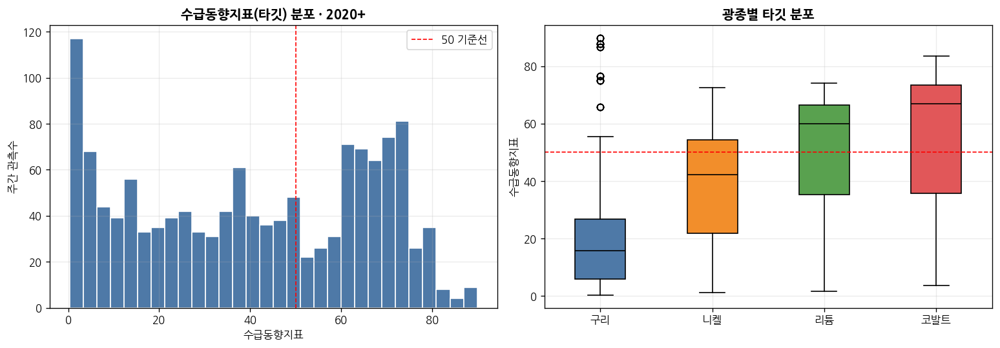
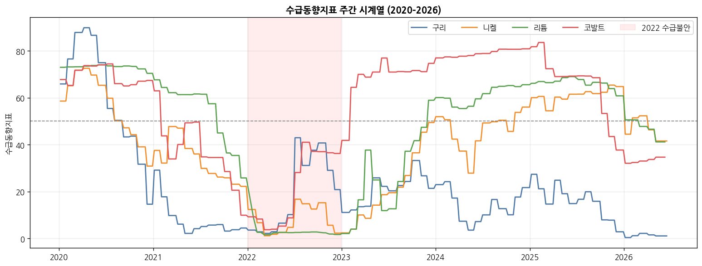
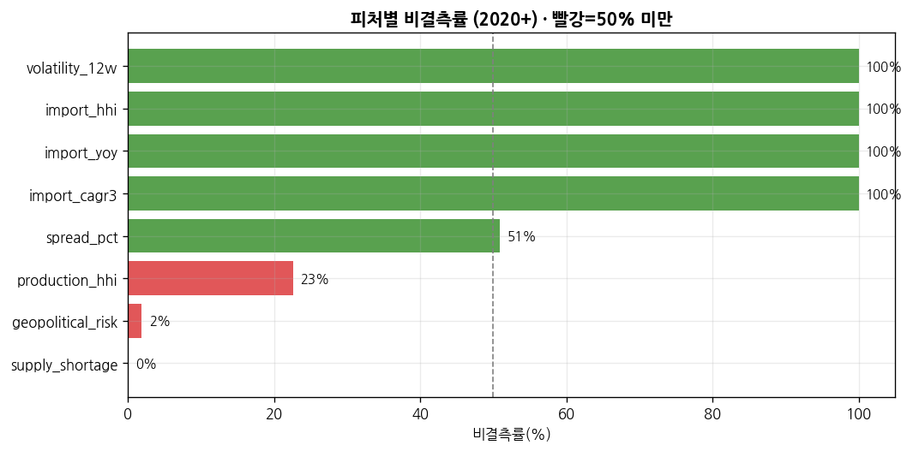
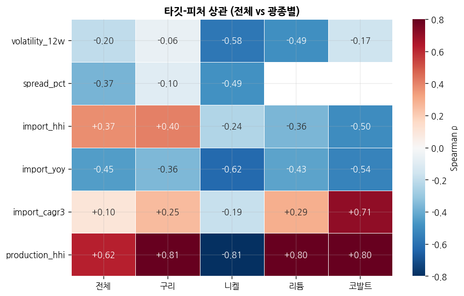
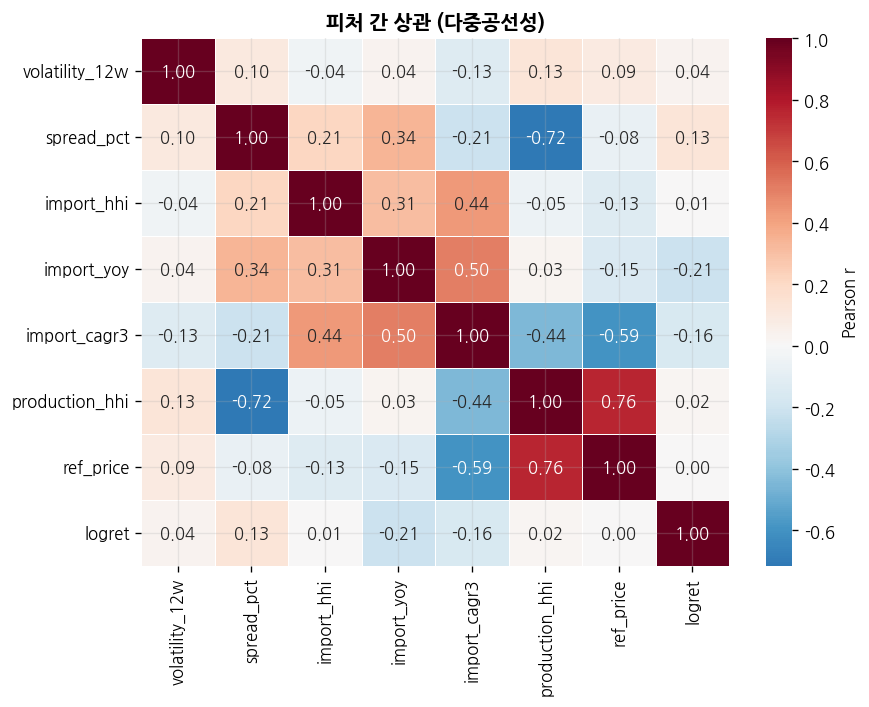
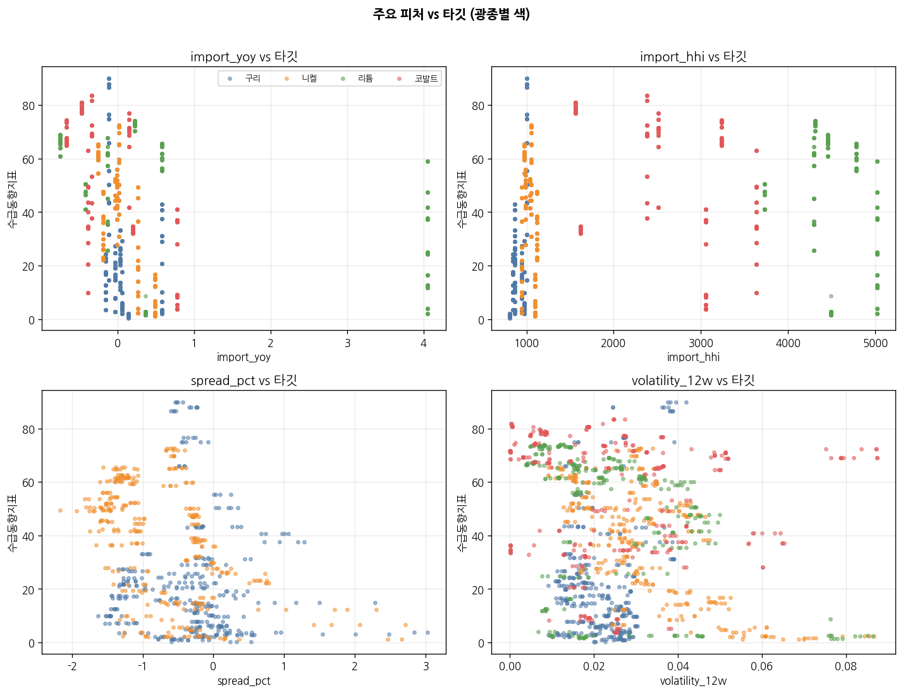

# 진단모델 EDA 리포트 — `mart_weekly_diagnosis`

핵심광물 수급위기 진단모델용 주간 학습 패널의 탐색적 분석. 대상 구간은 **교사신호(KOMIS 수급동향지표)가 존재하는 2020년 이후**이며, 분석 목적은 지도학습(회귀) 모델링에 앞서 데이터의 규모·품질·타깃 구조·피처 관계를 파악하고 모델 설계 방향을 확정하는 것.

---

## 1. 데이터 규모 및 커버리지

| 항목 | 내용 |
|---|---|
| 학습 대상 행수(2020+) | **1,322행** |
| 광종 | CO(코발트)·CU(구리)·LI(리튬)·NI(니켈), 광종당 312~337주 |
| 기간 | 2020-01-06 ~ 2026-06-15 (주간) |
| 타깃 | `teacher_supply_demand` — 비결측 **100%** |
| 제외 | **REE(희토류)** — 주간가격 미보유로 주간 패널에서 빠짐 (별도 월간 패널 필요) |

전체 원천 DB(`minerals.duckdb`)에는 fact_price 62K·fact_trade 105K 등이 적재돼 있으나, 교사신호가 붙는 주간 패널의 유효 학습 구간은 위 1,322행이다.

---

## 2. 타깃 분포 — 이분화된 신호

수급동향지표는 평균 40.6, 표준편차 25.8로 **0~90 전 구간에 넓게 퍼져 있고 중앙이 비어 있는** 형태다(왜도 −0.06, 첨도 **−1.36** → 정규분포보다 평평·양극단 편중). 50 기준선을 사이에 두고 위기(저값)와 안정(고값)이 뚜렷이 갈린다.

| 밴드 | 관측수 | 비중 |
|---|---|---|
| 0–20 (위기) | 374 | 28.3% |
| 20–40 | 266 | 20.1% |
| 40–60 | 237 | 17.9% |
| 60–80 | 406 | 30.7% |
| 80–100 (안정) | 39 | 3.0% |

> 회귀뿐 아니라 **위기/정상 이진 분류 또는 밴드 다중분류**로도 자연스럽게 프레이밍된다. 중앙(40–60)이 상대적으로 희박해 분류 경계가 비교적 선명하다.

광종별 수준차가 크다: **CU 평균 21.4(만성적 수급 타이트)** ↔ **CO 55.1(상대적 여유)**, LI 48.1, NI 38.4. 즉 절대값은 광종마다 기준선이 다르다.

---

## 3. 타깃 시계열 — 2022 수급위기와 "계단형" 구조

- **2022년 전 광종 동반 급락**(공통 충격 = 러-우 전쟁·에너지·물류)이 명확히 드러난다. 위기 국면 탐지라는 과업 목표에 부합하는 신호.
- 선이 **주간이 아니라 월 단위로 계단처럼 꺾인다.** 이는 월간 KOMIS 지표를 ASOF로 주간에 확장(upsample)했기 때문이다.
- 결과적으로 **주간 자기상관이 lag1=0.99, lag4(1개월)=0.94~0.97**로 극단적으로 높다.

> ⚠️ **모델링 핵심 함의:** 주간 행은 사실상 독립 표본이 아니다. 무작위 train/test 분할이나 K-fold는 같은 달의 행이 양쪽에 섞여 **정보 누수 → 성능 과대평가**를 유발한다. 반드시 **시간순 분할 + 광종 그룹 인지 CV**(또는 월 단위로 다운샘플)를 써야 한다.

---

## 4. 결측 현실 — 과업 6변수 중 절반만 가용

| 피처 | 과업변수 | 비결측률 | 판단 |
|---|---|---|---|
| `volatility_12w` | ① 시장변동성 | 100% | ✅ 사용 |
| `import_hhi` | ② 수입편중도 | 100% | ✅ 사용 |
| `import_yoy` / `import_cagr3` | ③ 수입증가도 | 100% | ✅ 사용 |
| `spread_pct` | Cash−3M | 50.8% | △ CU·NI만 존재 |
| `production_hhi` | ⑤ 생산독점도 | 22.6% | △ USGS 최근연도만 |
| `geopolitical_risk` | ⑥ 지정학 | 1.9% | ✖ **발주처 제공 예정** |
| `supply_shortage` | ④ 공급부족 | 0% | ✖ **소비량 데이터 미확보** |

> 과업이 정의한 6개 위기변수 중 **③④⑥가 사실상 비어 있다.** 현 시점 실학습 가능한 피처는 변동성·수입HHI·수입증감·(부분)스프레드 4종이다. ④공급부족·⑥지정학은 데이터 확보 시 동일 구조로 컬럼만 채우면 되고, 그때 모델 재학습으로 성능 개선 여지가 크다.

---

## 5. 타깃–피처 관계

전체 스피어만 상관(절대값 순):

| 피처 | n | Spearman ρ | 해석 |
|---|---|---|---|
| `production_hhi` | 299 | **+0.62** | 생산 집중↑ → 지표↑ (단 커버리지 23%, 최근연도 편향 주의) |
| `import_yoy` | 1322 | **−0.45** | 수입 급증↑ → 지표↓ (수급 압박 신호) |
| `import_hhi` | 1322 | +0.37 | 수입 편중↑ → 지표↑ |
| `spread_pct` | 672 | −0.37 | 백워데이션(현물 강세)↑ → 지표↓ |
| `volatility_12w` | 1322 | −0.20 | 변동성↑ → 지표↓ |
| `import_cagr3` | 1322 | +0.10 | 약함 |

**가장 중요한 발견 — 관계의 부호가 광종마다 뒤집힌다:**

- `import_hhi`: CO **−0.50** ↔ CU **+0.40**
- `import_cagr3`: CO **+0.71** ↔ NI **−0.19**
- `volatility_12w`: CU −0.06(무관) ↔ NI **−0.58**(강함)

> 단일 전역(pooled) 선형모델은 이런 부호역전을 평균내어 상쇄시킨다. **광종 고정효과(one-hot) 또는 광종×피처 상호작용**, 혹은 **광종별 개별 모델**이 필요하다. 트리기반 모델(GBM/RandomForest)은 광종을 분기변수로 넣으면 이 비선형·조건부 관계를 자연히 포착한다 → 1차 후보로 유력.

---

## 6. 피처 간 상관 (다중공선성)

- `production_hhi` ↔ `ref_price` **+0.76**, `production_hhi` ↔ `spread_pct` **−0.72** — 강한 공선성. 선형모델 사용 시 계수 해석 주의(트리기반은 영향 적음).
- `import_cagr3` ↔ `ref_price` −0.59, `import_yoy` ↔ `import_cagr3` +0.50 — 수입계 피처끼리 중복정보.

산점도에서도 광종별 군집이 뚜렷이 분리돼(색상), 관계가 광종 조건부임을 재확인.

---

## 7. 모델링 시사점 (다음 단계 설계)

1. **검증 설계가 최우선.** 타깃이 월간→주간 확장이라 자기상관 0.99. → 시간순 홀드아웃(예: ~2024 학습 / 2025~ 검증) + 광종 그룹 유지. 무작위 CV 금지.
2. **광종 이질성 반영.** 부호역전 때문에 광종 고정효과·상호작용 또는 광종별 모델 필수. 1차: **GBM(광종 포함) vs 광종더미 선형모델** 비교.
3. **피처 셋.** 실사용 4종(변동성·수입HHI·수입YoY/CAGR3)로 시작. `spread_pct`·`production_hhi`는 결측 처리(트리는 결측 분기 가능, 선형은 대치/제외) 후 실험적으로 추가.
4. **문제 프레이밍 이중화.** (a) 회귀(지표값 예측) + (b) 위기 이진분류(예: <20 위기) — 후자가 실무 경보에 더 직접적이고 분포상 경계도 선명.
5. **미확보 변수 로드맵.** ④소비/공급부족, ⑥지정학 확보 시 재학습으로 성능·설명력 상승 기대. 현 모델은 **부분 피처 기준 베이스라인**으로 명확히 문서화.
6. **REE 별도 트랙.** 주간가격 부재 → 월간(교역·생산·교사신호) 패널로 독립 진단.

---

## 산출물

| 파일 | 내용 |
|---|---|
| `fig1~fig6_*.png` | 분포·시계열·결측·상관·산점 시각화 |
| `profile_stats.csv` | 피처별 기초통계·결측률 |
| `profile_summary.json` | 타깃 요약 통계 |
| `target_feature_corr.csv` | 타깃-피처 상관표 |
| `feature_corr_matrix.csv` | 피처 간 상관행렬 |

*분석 기준: 2020-01 ~ 2026-06 주간 패널, `minerals.duckdb`.*
