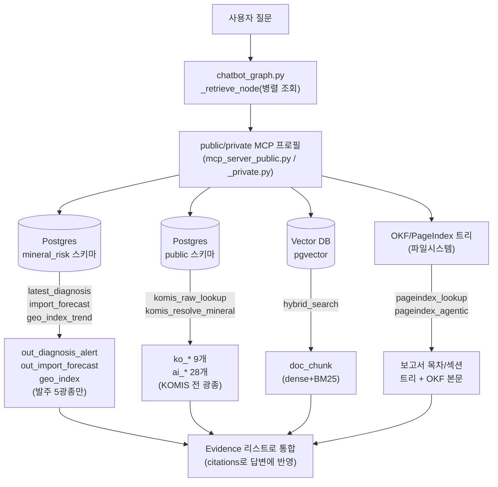

# 챗봇 PostgreSQL/MCP 데이터 접근 명세

> 정본 원칙: 이 문서는 2026-08-31~09-01 `komis_raw_lookup`/`komis_resolve_mineral`
> MCP 도구 신설·확장 작업(worktree-chatbot 세션) 중 실측·실코드로 확인한 내용을
> 정리한 것이다. 코드가 바뀌면 이 문서도 갱신이 필요하다(각 절에 근거 파일 경로를
> 남겨 재현 가능하게 함). DuckDB 시절 스키마는 `documents/meta/DB_SCHEMA.md`
> (별개 문서, `minerals.duckdb` 전용)를 볼 것 — 이 문서는 **Postgres**만 다룬다.

## 0. 핵심 요지 — "public/private"가 두 가지 다른 뜻으로 쓰인다

이 프로젝트에서 챗봇이 접근하는 Postgres(`komis_demo` DB, `172.30.1.101:5432`)
안에는 **소유자가 다른 두 스키마**가 공존한다.

| 스키마 | 소유 | 성격 |
|---|---|---|
| `mineral_risk` | **komir(우리)** | 우리가 계산·발행한 산출물(진단·예측·지수) + RAG 벡터(`doc_chunk`) |
| `public` | **KOMIS(타 팀)** | KOMIS가 자체 웹사이트에서 공개하는 원천 데이터(`ko_*`) + 그 마스터/매핑 테이블(`ai_*`) — **읽기 전용, 절대 쓰기 금지** |

이것과 **완전히 별개의 축**으로, 챗봇 MCP 서버는 **public/private "프로필"** 로도
나뉜다(`mcp_server_public.py` / `mcp_server_private.py`, 물리적으로 분리된
두 파일). 이건 스키마 이름과 무관하고, **제3자 라이선스 제한 콘텐츠(Argus
비철금속 일일동향)를 포함할지 여부**만 가른다. 이름이 같아 혼동하기 쉬우니
아래부터는 스키마는 `public` 스키마/`mineral_risk` 스키마로, MCP는
public 프로필/private 프로필로 항상 구분해 쓴다.

**기존에 komir 자신이 쓰던 Postgres 설정(`PG_DSN`, `PG_SCHEMA`)은
`mineral_risk` 스키마 전용이었다** — `services/shared/db.py::read_sql_pg()`의
원래 취지가 그것이다. `public` 스키마(KOMIS 원천)는 2026-08-31에 새로
추가된, 완전히 다른 접근 경로(`services/shared/komis_raw.py`)를 쓴다. 이
문서가 그 둘을 분명히 가르는 게 목적이다.

## 0-1. 요구사항 — public MCP는 4개 이질적 데이터원을 단일 게이트웨이로 통합한다

`mcp_server_public.py`(챗봇 public MCP 프로필)는 아래 **4가지 서로 다른
저장소 종류**를 하나의 조회 인터페이스(도구 8종, §1-3·§2-3)로 묶어
챗봇 답변의 근거로 제공해야 한다 — 이미 그렇게 구현돼 있다(아래 표가
현재 코드 상태의 확인이다, 신규 요구사항이 아니라 기존 설계의 명시화).

| 데이터원 | 저장 형태 | 담당 도구 | 절 |
|---|---|---|---|
| Postgres `mineral_risk` 스키마 | 관계형 테이블 | `latest_diagnosis`·`import_forecast`·`geo_index_trend` | §1 |
| Postgres `public` 스키마(KOMIS 원천) | 관계형 테이블 | `komis_raw_lookup`·`komis_resolve_mineral` | §2 |
| OKF/PageIndex 트리 | 파일시스템(마크다운+JSON 트리) | `pageindex_lookup`·`pageindex_agentic` | §1-3 |
| Vector DB(pgvector, `mineral_risk.doc_chunk`) | Postgres 확장(벡터 컬럼) | `hybrid_search`(dense+BM25 RRF) | §1-3 |

### 0-1-1. 구조도



⚠ OKF와 PageIndex는 같은 파이프라인의 앞뒤 단계다 — OKF는 원본 보고서
(PDF/HWP/docx 등)를 LLM/파서로 마크다운화한 중간 산출물이고, PageIndex는
그 OKF 마크다운에서 목차/섹션 트리를 뽑아 만든 탐색 구조다. `pageindex_
lookup`/`pageindex_agentic`은 트리를 거쳐 결국 OKF 본문 텍스트를 근거로
반환한다 — 별도의 두 저장소가 아니라 한 파이프라인의 산출물 2종.

이 4개 데이터원 각각의 내부에도 **다시 public/private로 갈리는 항목이
있다** — "이 4개 데이터원을 다 쓴다"는 것과 "그 안의 어느 조각이
public/private로 갈리는가"는 서로 다른 축이다(§0의 혼동 방지 원칙과
일관). `hybrid_search`·`pageindex_lookup`은 **제3자 라이선스(Argus)
콘텐츠 포함 여부**로(§1-3), `komis_raw_lookup`은 2026-09-01부터 **일부
`page_id`**로(§2-3) 갈린다 — 전체 식별표는 §0-2 참고.

챗봇 그래프(`chatbot_graph.py::_retrieve_node`)는 매 턴마다 라우터
LLM이 고른 도구들을 스레드풀로 **병렬 조회**해 하나의 근거(Evidence)
리스트로 합친다 — 즉 한 답변이 Postgres 두 스키마+OKF/PageIndex+
Vector DB 중 여러 개를 동시에 근거로 삼을 수 있다(예: "니켈 가격+공급위기
원인" 같은 복합 질문은 `komis_raw`+`hybrid_search`+`pageindex`를 한 번에
켤 수 있음).

### 0-2. 전체 데이터 식별표(RDB·VectorDB·OKF/PageIndex × public/private/common)

2026-09-01 사용자 요청으로 작성. `공통(common)`은 public/private 프로필
결과가 완전히 같다는 뜻이고(private가 public의 상위집합이라 "public
전용"은 존재하지 않는다), `private 전용`은 public 프로필에서 조회/검색
자체가 거부된다는 뜻이다. 건수는 아래 "재현" 쿼리로 2026-09-01 직접
실측한 값 — 문서 재인용이 아니다(`data-quantity-verification-rule`).

**A. RDB — Postgres `mineral_risk` 스키마(komir 자체 산출물, §1)**

| 테이블 | 내용 | 건수 | 분류 | 담당 도구 |
|---|---|---|---|---|
| `out_diagnosis_alert` | 수급위기 진단 등급(5광종) | 1,652 | common | `latest_diagnosis` |
| `out_import_forecast` | 12개월 수입물량/금액 예측(5광종) | 120 | common | `import_forecast` |
| `geo_index` | 지정학 위기지수(5광종) | 3,566 | common | `geo_index_trend` |

**B. RDB — Postgres `public` 스키마, `ko_*`(KOMIS 원천, §2)**

| 테이블 | 내용 | 건수 | page_id | 분류 |
|---|---|---|---|---|
| `ko_mnrl_prc` | 광종별 일별 가격 | 13,731 | `price_base_metals`/`_minor_metals`/`_iron_energy`/`_other` | public |
| `ko_mnrl_prc_predc` | KOMIS 자체 가격예측 | 76 | `forecast_price` | public |
| `ko_cstm_cmmrc` | 국내(관세청) 수출입 | 22,486 | `map_korea` | public |
| `ko_un_cmmrc` | 세계(UN Comtrade) 교역 | 25,342 | `map_global` | public |
| `ko_rsrc_burudg_quty` | 국가별 매장량 | 272 | `map_mineral` | public |
| `ko_rsrc_prdctn_quty` | 국가별 생산량 | 279 | `map_mineral` | public |
| `ko_mnrl_snths_indx` | 광물종합지수 | 10,899 | `indicator_composite` | **private 전용** |
| `ko_mrkt_prspect_idct` | 시장동향지표(시장전망지표) | 170 | `indicator_market` | **private 전용** |
| `ko_spdm_stbt_indx` | 수급동향지표(수급안정지수) | 98 | `indicator_supply` | **private 전용** |

**C. RDB — Postgres `public` 스키마, `ai_*` 공통 메타(코드↔광종 변환 전용, §2-2)**

| 테이블 | 역할 | 건수 | 분류 |
|---|---|---|---|
| `ai_mnrl_mst` | 광종 마스터(코드↔한글명↔가격분류↔데이터출처) | 28 | common |
| `ai_prc_mnrl_map` | 광종→가격기준일련번호("SN-광종간 매핑정보") | 25 | common |
| `ai_hs_mnrl_map` | 광종→HS코드("HS코드-광종간 매핑 정보") | 56 | common |

⚠ 이 3개는 어느 `page_id`로도 직접 노출되지 않고 `komis_raw_lookup`
내부에서 코드→필터값 번역에만 쓰인다 — public 전용/private 전용
page_id 어느 쪽이 켜졌는지와 무관하게 항상 공통으로 참조된다.

**D. VectorDB — pgvector(`mineral_risk.doc_chunk`, `hybrid_search` 담당, §1-3)**

| 소스그룹(`src`) | 내용 | 건수 | 분류 |
|---|---|---|---|
| `Argus_비철금속_일일` | 제3자 라이선스(Argus) 비철금속 일일동향 | 77,648 | **private 전용** |
| `조달청보고서` | 조달청 주간동향 보고서 | 55,530 | common |
| `생산매장량_USGS` | USGS 광종별 생산량/매장량 보고서 | 5,647 | common |
| `외부자료` | 기타 외부 조달 자료 | 176 | common |
| `documents/산출물` | komir 자체 산출물(2026-08-28 A7 화이트리스트로 제한된 서브셋, `rag_incoming_corpus_restriction_260828`) | 108 | common |

**E. OKF/PageIndex — 파일시스템(`data_lake/semi_structure/{okf_documents,pageindex_trees}`, `pageindex_lookup`·`pageindex_agentic` 담당, §1-3)**

| 소스그룹(`source_group`) | 내용 | 파일 수 | 분류 |
|---|---|---|---|
| `Argus_비철금속_일일` | 제3자 라이선스(Argus) 비철금속 일일동향 | 690 | **private 전용** |
| `조달청보고서` | 조달청 주간동향 보고서 | 868 | common |
| `생산매장량_USGS` | USGS 광종별 생산량/매장량 보고서 | 8 | common |
| `외부자료` | 기타 외부 조달 자료 | 4 | common |
| `기타` | 미분류 | 7 | common |

⚠ D·E는 원천은 같은 코퍼스지만 그룹 목록이 완전히 일치하진 않는다 —
`documents/산출물`은 D(VectorDB)에만 있고(OKF/PageIndex 트리를 안 거치고
직접 청킹·색인됨), `기타`는 E(OKF/PageIndex)에만 있다(아직 벡터
색인이 안 된 상태로 추정, 미확인). `pageindex_agentic`은 이 중
`생산매장량_USGS` 그룹만 스캔한다(Argus를 애초에 안 건드려 프로필
무관, §1-3).

**재현(2026-09-01 실측 쿼리)**:
```bash
# RDB 건수(komir-rag-chat-test 컨테이너, PYTHONPATH=/app)
python3 -c "
from shared.db import read_sql_pg
for schema, t in [('mineral_risk','out_diagnosis_alert'), ('public','ko_mnrl_prc'), ...]:
    print(schema, t, read_sql_pg(f'select count(*) as n from {schema}.{t}').iloc[0]['n'])
"
# VectorDB 소스그룹별 건수
python3 -c "
from shared.db import read_sql_pg
print(read_sql_pg('select src, count(*) as n from mineral_risk.doc_chunk group by src order by n desc'))
"
# OKF/PageIndex 소스그룹별 파일 수
find data_lake/semi_structure/okf_documents -maxdepth 1 -mindepth 1 -type d \
  -exec sh -c 'echo -n "{}: "; find "{}" -type f | wc -l' \;
```

## 1. `mineral_risk` 스키마 — komir 자체 산출물

### 1-1. 접근 계층

- 함수: `services/shared/db.py::read_sql_pg(query)` — `.env`의 `PG_DSN`으로
  접속, 쿼리 문자열에 스키마를 명시할 땐 `get_settings().PG_SCHEMA`
  (=`mineral_risk`)를 쓰고 **`public`을 하드코딩하지 않는다**는 게 이
  함수의 원래 규약이다(`komis_raw.py`가 이 규약의 유일한 의도적 예외 —
  §2 참고).
- 챗봇이 쓰는 3개 정형 템플릿(§1-2)은 `services/shared/retrieval/
  structured.py`에 화이트리스트 템플릿으로만 구현돼 있다 — LLM이 자유형
  SQL을 짓지 않고, "어떤 템플릿+어떤 광종"만 고른다.
- RAG 벡터 검색(`doc_chunk`, pgvector)은 `services/shared/retrieval/
  dense_pg.py`(dense)·`bm25_pg.py`(BM25, RRF 하이브리드의 절반)·
  `pageindex.py`(OKF 트리 기반)가 각각 담당.

### 1-2. 테이블

| 테이블 | 내용 | 광종 범위 |
|---|---|---|
| `out_diagnosis_alert` | 4단계 수급위기 경보(risk_score·alert_level·reason) | **발주 5광종만**(CU/NI/CO/LI/REE) — 진단모델이 이 5광종만 계산 |
| `out_import_forecast` | 12개월 수입 물량/금액 예측 | 5광종만 |
| `geo_index` | 지정학 위기지수(주/월/연) | 5광종만 |
| `doc_chunk` | RAG 벡터 청크(pgvector, dense+BM25 하이브리드) | 광종 제한 없음(문서 기반 검색) |

⚠ 이 5광종 제한은 **인위적 화이트리스트가 아니라 데이터 자체의 한계**다 —
komir의 진단·예측·지수 모델이 애초에 이 5광종만 계산해 발행하도록 설계돼
있다(CLAUDE.md §0 "대상 5광종"). 2026-09-01 이전엔 챗봇 프롬프트에도 이
5광종 제한이 별도로 걸려 있었는데(`CHATBOT_SYSTEM_PROMPT` 규칙11), 사용자
지시로 **챗봇 자체의 제한은 제거**하고 `mineral_risk`(=이 4개 테이블)에만
남겼다 — §3 참고.

### 1-3. MCP 도구 (public/private 프로필 결과 동일 — 라이선스 무관)

- `latest_diagnosis(commodity_code)` — `out_diagnosis_alert`
- `import_forecast(commodity_code, target, horizon)` — `out_import_forecast`
- `geo_index_trend(commodity_code, freq, limit)` — `geo_index`
- `hybrid_search(query, k, fanout)` — `doc_chunk`(dense+BM25). **여기만
  프로필별 결과가 다르다** — public 프로필은 Argus 소스를 SQL 단에서
  하드코딩으로 항상 제외(`shared.retrieval.access.PRIVATE_ONLY_SOURCE_GROUPS`).
- `pageindex_lookup(query, doc, ...)` — OKF 트리(파일시스템, DB 아님).
  Argus 제외 여부는 hybrid_search와 동일한 축.
- `pageindex_agentic(query, history)` — USGS 코퍼스만 스캔(Argus를 애초에
  안 건드려 프로필 무관).

## 2. `public` 스키마 — KOMIS 자체 공개 원천

### 2-1. 접근 계층

- 클래스: `services/shared/komis_raw.py::KomisRawDataRepository` —
  **`read_sql_pg()`를 그대로 쓰되, `public` 스키마를 명시적으로 하드코딩
  하는 유일한 모듈**(`KOMIS_SCHEMA = "public"` 상수). 파일 상단 docstring에
  이 예외를 명시적으로 정당화해뒀다: "`public.`을 그대로 명시한다.
  `services/shared/db.py`의 'PG_SCHEMA를 쓰고 public을 하드코딩하지 말
  것'은 *komir 자신의 산출물*에 대한 규칙이지, 타 팀 테이블을 읽는 경우가
  아니다."
- **2단계 화이트리스트 SQL 안전장치**(자유형 SQL 생성 절대 금지):
  1) `AnalysisPreviewRequest`(pydantic) — page_id는 11개 값 `Literal`,
     `start_period`/`end_period`는 숫자 4/6/8자리 정규식으로 1차 검증.
  2) `_literal()` — SQL 리터럴로 삽입되기 직전, `_SAFE_VALUE` 정규식
     (`^[A-Za-z0-9_가-힣]{1,32}$` — 2026-09-01 한글 음절 허용 추가, 아래
     §2-4)을 통과해야 한다. 테이블·컬럼명은 코드에 고정된 정적 스펙
     (`_PAGE_DATASETS`)에서만 오고 사용자 입력이 절대 안 섞인다. `LIKE`/
     `%` 와일드카드는 아예 안 쓴다.
  이 두 단계는 `services/shared/retrieval/structured.py`의 "화이트리스트
  템플릿만, 자유형 NL→SQL 금지" 원칙과 동일하다.

### 2-2. 테이블(37개 전수, `public` 스키마)

**`ko_*`(9개, KOMIS 원천 데이터)** — 2026-08-31 스키마매핑 실측
(`documents/산출물/2026-W36_0831-0906/KOMIS_public_ko테이블_스키마매핑_260831.md`
참고, 이하 요약). **MCP 프로필 접근**(2026-09-01 사용자 지시,
`shared.retrieval.access.PRIVATE_ONLY_KOMIS_PAGES`) 열은 이 테이블이
`komis_raw_lookup`의 어느 page_id로 나가고 어느 MCP 프로필에서 조회
가능한지를 보인다:

| 테이블 | 내용 | page_id | MCP 프로필 접근 |
|---|---|---|---|
| `ko_mnrl_prc` | 광종별 일별 가격(최저/최고/실거래가) | `price_base_metals`/`price_minor_metals`/`price_iron_energy`/`price_other` | public+private |
| `ko_mnrl_prc_predc` | KOMIS 자체 가격예측(komir의 `out_import_forecast`와 다름) | `forecast_price` | public+private |
| `ko_mnrl_snths_indx` | 종합지수(HI001~003, 구성 의미 미확인, 광물종합지수) | `indicator_composite` | **private 전용**(2026-09-01 최초 public 지정 후 같은 날 정정) |
| `ko_mrkt_prspect_idct` | 시장전망지표(시장동향지표) | `indicator_market` | **private 전용** |
| `ko_spdm_stbt_indx` | 수급안정지수(수급동향지표) | `indicator_supply` | **private 전용** |
| `ko_cstm_cmmrc` | 국내(관세청) 수출입 | `map_korea` | public+private |
| `ko_un_cmmrc` | 세계(UN Comtrade) 교역 | `map_global` | public+private |
| `ko_rsrc_burudg_quty` | 국가별 매장량 | `map_mineral` | public+private |
| `ko_rsrc_prdctn_quty` | 국가별 생산량 | `map_mineral` | public+private |

**`ai_*`(28개, 마스터/매핑 + KOMIS 사이트 자체 AI 기능 추정)** — 이 중
실제로 쓰는 3개(코드↔광종 조회의 근간, **어느 page_id로도 직접 노출되지
않고 komis_raw.py 내부 번역에만 쓰여 위 private 전용 제한과 무관 — 항상
public+private 공통**):

| 테이블 | 역할 |
|---|---|
| `ai_mnrl_mst` | 광종 마스터 — 코드(`mnrknd_unq_cd`)·한글명(`mnrl_nm_ko`)·가격분류(`prc_cat_cd`, HP001~004)·데이터출처(`ko_data_src_cd`) |
| `ai_prc_mnrl_map` | 광종 → 가격기준일련번호(`ko_mnrl_prc.mnrl_prc_crtr_sn`) 매핑(1:N, "SN-광종간 매핑정보") |
| `ai_hs_mnrl_map` | 광종 → HS코드(`ko_cstm_cmmrc`/`ko_un_cmmrc.hs_cd`) 매핑(1:N, "HS코드-광종간 매핑 정보") |

나머지 25개 `ai_*`는 미조사(범위 밖 — `ai_mnrl_diag`·`ai_dash_diag`·
`ai_report`·`ai_evid`·`ai_news` 등, 이름으로 미루어 KOMIS 사이트 자체
AI 기능 또는 komir 산출물 발행 대상 스키마 둘 중 하나로 추정되나 미검증).

⚠ **`ai_mnrl_mst`에 등록된 광종은 19개뿐**(2026-09-01 실측)이고, 이 중
발주 5광종은 대부분 `ko_data_src_cd='DEV_DUMMY'`(개발용 더미 — 실제
KOMIS 표본 아님)다. 유일한 실샘플은 텅스텐(`MNRL0018`,
`ko_data_src_cd='KOMIS_SAMPLE'`). 사용자가 제시한 KOMIS 핵심/전략광물+
기타광물 전체 목록(약 80종)에 비하면 `ai_mnrl_mst`는 아직 일부만 채워진
상태 — 나머지 광종을 물으면 `komis_resolve_mineral`이 `mineral_code: null`
을 정직하게 돌려준다(§2-3).

### 2-3. MCP 도구 (`komis_resolve_mineral`은 public/private 프로필 결과
동일. `komis_raw_lookup`은 2026-09-01부터 **일부 page_id만** 예외 —
아래 참고. 둘 다 "타 팀 소유"일 뿐 원래는 제3자 재배포 제한 콘텐츠가
아니었으나, 2026-09-01 사용자가 `indicator_market`/`indicator_supply`/
`indicator_composite` 3개 page_id만 private 프로필 전용으로 지정했다 —
`indicator_composite`는 최초엔 public으로 지정됐다가 같은 날 정정됨)

- `komis_resolve_mineral(korean_name)` — 한글 광종명(자유형, "텅스텐"처럼
  질문에 쓰인 그대로) → `{mineral_code, price_category, warnings}`.
  `ai_mnrl_mst`를 **매 요청 실조회**한다(하드코딩 딕셔너리 아님 — KOMIS가
  광종을 추가해도 코드 수정 불필요). 흔한 동의어(구리→동, 납→연,
  희토류→네오디뮴) 3쌍만 코드에 보정 목록으로 남아 있다(`ai_mnrl_mst`엔
  동의어 컬럼이 없어서).
- `komis_raw_lookup(page_id, mineral_code, ...)` — 11개 `page_id`(가격
  4종·교역 2종·매장량생산량·시장전망·수급안정·가격예측·종합지수)별로
  정해진 테이블만 조회. `mineral_code`만 주면 내부에서 `ai_mnrl_mst`를
  다시 조회해 근거(Evidence) 라벨을 한글명으로 채운다(예: "KOMIS 원천 ·
  KO_MNRL_PRC(텅스텐)") — 2026-09-01 실사용 버그로 발견: 라벨이 코드
  그대로 노출되면 검증(verify) LLM이 광종을 못 알아보고 근거를 버리는
  사고가 실측됐다.
  `mineral_code`가 가격/국내교역/세계교역 페이지에 직접 없으면(가격기준
  일련번호·HS코드로만 연결) `ai_prc_mnrl_map`/`ai_hs_mnrl_map`으로
  자동 번역한다(1:N이면 첫 값만, `warnings`에 명시).
  더미데이터 경고: `mineral_code`의 `ai_mnrl_mst.ko_data_src_cd`가
  `KOMIS_SAMPLE`이 아니면 `Evidence.caveat`에 강제 경고 문구를 심고,
  `chatbot.py::_dummy_data_notice()`가 인용 스트리퍼 통과 후 코드로
  화면에 무조건 노출한다(LLM이 알아서 옮겨 적을 거라 기대하지 않음).
  **private 전용 page_id 거부**(2026-09-01): `page_id`가
  `indicator_market`/`indicator_supply`/`indicator_composite`면 public
  프로필에서는 DB 조회 자체를 하지 않고 `{"evidence": [], "warnings": ["'...'는 private
  전용 데이터입니다..."]}`를 즉시 반환한다(`_mcp_tools_common.py::
  register_common_tools`의 `private_only_pages` 인자,
  `mcp_server_public.py`만 `PRIVATE_ONLY_KOMIS_PAGES`를 소스코드로 넘김 —
  hybrid_search/pageindex_lookup과 같은 원칙으로 신뢰 경계가 "어느 파일을
  실행했는가"에 있음, 런타임 플래그 아님). `chatbot_graph.py::_retrieve_node`는
  이 경우를 별도 분기 없이 그대로 처리한다 — evidence가 비면 인용이 안
  붙고 warnings는 기존 기권사유 분류 경로를 그대로 탄다.

### 2-4. 안전장치 변경 이력

- `_SAFE_VALUE` 정규식이 원래 `^[A-Za-z0-9_]{1,32}$`(영문자·숫자·밑줄만)
  였는데, 2026-09-01 한글 음절(U+AC00~U+D7A3) 범위를 추가했다 —
  `resolve_mineral_full()`이 `ai_mnrl_mst.mnrl_nm_ko`(한글 광종명)를
  조회 조건으로 써야 해서다. **인젝션 방어력은 그대로다** — 따옴표·
  세미콜론·백슬래시·공백 등 SQL 메타문자는 여전히 전부 제외되고, 허용
  문자 "집합"만 넓어졌다(순수 한글 음절은 SQL 메타문자를 포함하지 않음).

## 3. 챗봇 그래프 라우팅과의 관계

`rag/ragkit/chatbot_graph.py::RetrievalRoute`가 LLM 라우터의 결정을 담는
모델이다 — 두 스키마 접근이 **서로 다른 필드**로 분리돼 있다.

- `commodity_code: Literal["CU","NI","CO","LI","REE"] | None` — `structured`
  (§1-2, `mineral_risk`) 전용. 5광종 고정.
- `komis_mineral_name: str | None` — `komis_raw`(§2-3, `public`) 전용.
  자유형 한글명, 광종 제한 없음.

라우터 LLM은 질문 성격에 따라 둘 중 하나(또는 둘 다, 또는 둘 다 아님)를
켠다 — "니켈 수급위기 진단등급"류는 `structured`(`commodity_code=NI`),
"텅스텐 가격"류는 `komis_raw`(`komis_mineral_name=텅스텐`)만 켜진다(NI가
아니면 애초에 `structured` 후보가 아님).

## 4. 재현/검증 방법

```bash
cd komir/inhouse
# mineral_risk 스키마 확인
python3 -c "
from services.shared.db import read_sql_pg
print(read_sql_pg(\"select count(*) from mineral_risk.out_diagnosis_alert\"))
"
# public 스키마 확인(반드시 KomisRawDataRepository 경유 — 직접 SQL 금지)
python3 -c "
from services.shared.komis_raw import KomisRawDataRepository
repo = KomisRawDataRepository()
print(repo.resolve_mineral_full('텅스텐'))
"
# MCP 도구 전체 회귀
python3 services/rag_chat/tests/smoke_mcp_access.py
```
