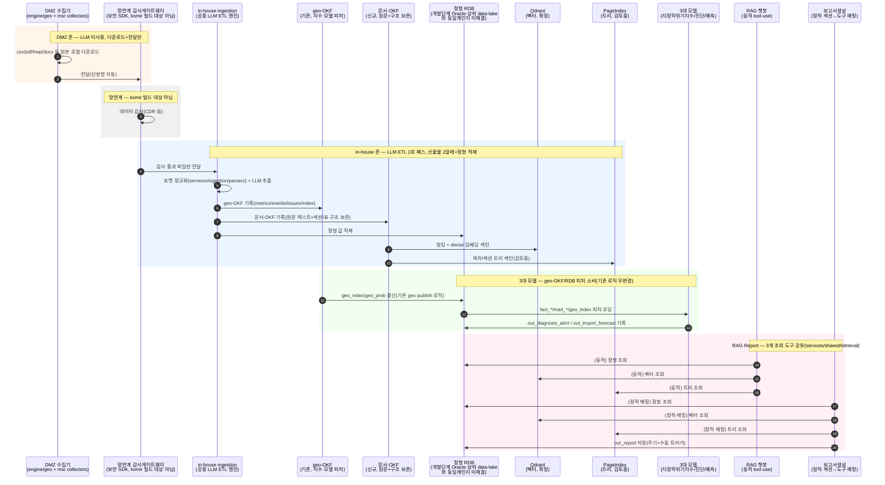

# 목표 아키텍처 — DMZ/망연계/in-house 데이터 흐름 (설계, 2026-08-06)

작성일: 2026-08-06
성격: **목표 설계**(미구현) — `docs/CONTAINER_ARCHITECTURE.md` §0-1·§5·§6·§7의 시퀀스
다이어그램판. 8/6 대화에서 사용자가 직접 확정·정정한 배포 토폴로지를 반영.

> **현재 운영 상태와의 관계**: `전체프로세스_시퀀스다이어그램_260806.md`(같은 폴더)는
> **지금 실제로 도는 파이프라인**(단일 존, cron 기반)을 그린 것이고, 이 문서는 그것이
> 앞으로 향해야 할 **목표 구조**다 — 둘을 같은 걸로 혼동하지 말 것. 특히 지금
> `cron_gkg_increment.sh`는 다운로드(비-LLM)와 `gkg_verify`(LLM)를 같은 스크립트·같은
> 호스트에서 순차 실행 중인데, 목표 구조에서는 이 둘이 DMZ/in-house로 물리적으로
> 갈라진다.

## 1. 확정된 전제 (2026-08-06, 사용자 확인)

- **DMZ 존**: `engine/geo/collectors`(GDELT/GKG) + `engine/mineral_supply_risk/msr/collectors`
  (관세청·ECOS·KOMIS·거래소 등) 전부. LLM 사용 불가. 원본(csv/pdf/hwp/docx 등) 로컬
  다운로드 → in-house 전달로 역할 종료 — 가공·DB 적재 없음.
- **망연계**: 단방향 자동 네트워크, 보안감사 SDK/솔루션이 중간에서 데이터 감사(CDR류)
  후 전달. komir이 빌드하는 대상 아님 — 인터페이스 지점으로만 취급.
- **in-house(airgap) 존**: LLM 서버 + 상위 data-lake(비정형+RDB) 접속 가능. `ingestion`이
  공용 LLM ETL 엔진 — 원문 1건당 geo-OKF(기존, 지수·모델 피처용)와 문서-OKF(신규,
  원문+구조 보존) 두 산출물을 동시에 낸다.
- **정형 RDB**: 벤더 미확정, 개발단계는 Oracle. 가공된 정형 데이터·RAG 정형 피처·
  진단/예측 모델 피처 전부 여기 적재.
- **비정형 검색**: Qdrant(벡터, 확정) + PageIndex(트리 기반, 검토중) 이원화. 온톨로지 배제.
- **RAG·Report 공용 도구**: RDB 조회·VectorDB 조회·PageIndex 조회 3종을
  `services/shared/retrieval/`로 공유. 호출 방식은 RAG=동적, Report=정적(섹션→도구 매핑).
- **미해결(추측하지 않음)**: 상위 data-lake와 "정형 RDB(Oracle 개발단계)"가 동일 시스템인지
  2단 구조인지, RDB 최종 벤더, 비정형 저장소 최종 형식, PageIndex 채택 여부.

## 2. 전체 흐름 (시퀀스 다이어그램)

> **⚠ 다이어그램 주의**: 위 그림은 "RDB" 노드 하나만 그린다 — 이건 편의상 단순화한
> 것이지, §1에서 미해결로 남긴 "상위 data-lake와 이 RDB가 같은 시스템인지 2단
> 구조인지"가 해결됐다는 뜻이 아니다(적대적 검증에서 지적됨). 2단 구조로 판명되면
> 이 다이어그램에 data-lake→RDB ETL 단계가 추가로 들어가야 한다.

## 3. 모듈별 역할 (목표 상태)

| 모듈 | 존 | 역할 | 비고 |
|---|---|---|---|
| `engine/geo/collectors`, `engine/mineral_supply_risk/msr/collectors` | DMZ | 원본 다운로드, LLM 미사용, DB 미적재 | collectors 자체는 이미 fetch/load 분리(`sink` 콜백 패턴) — 실제 즉시-DB적재 지점은 `msr/scripts/backfill_customs_monthly.py` 등 드라이버 스크립트의 `_sink` 콜백. 리팩터 대상은 collectors가 아니라 이 드라이버들(`CONTAINER_ARCHITECTURE.md` §8, 2026-08-06 정정) |
| 보안감사 SDK/솔루션 | 망연계 | 데이터 감사 후 단방향 전달 | komir 빌드 대상 아님, 인터페이스만 |
| `services/ingestion/parsers/*` | in-house | 포맷별(pdf/hwp/docx/xlsx 등) 텍스트+표 정규화 | 설계만, 스텁 |
| in-house LLM ETL 엔진(신규 통합) | in-house | 원문 1건당 geo-OKF+문서-OKF 동시 생성 | `engine/geo`의 기존 추출 로직 재사용·확장 |
| geo-OKF (`geo_data/okf/`) | in-house | 지수·진단/예측 모델 피처용 파생 지식층 | 기존 그대로, 원문 포인터만 보유 |
| 문서-OKF(신규) | in-house | 원문 텍스트+구조 보존, Qdrant·PageIndex 공통 소스 | 신규 설계, 저장 위치 미정 |
| 정형 RDB | in-house | 가공된 정형 데이터, RAG/모델 피처 | 벤더 미확정, 개발단계 Oracle |
| Qdrant | in-house | 벡터 검색 | 확정(8/5) |
| PageIndex | in-house | 트리 기반 구조 탐색 | 검토중, 미확정 |
| `services/shared/retrieval/` | in-house | RDB·VectorDB·PageIndex 3종 공용 조회 도구 | RAG=동적 호출, Report=정적 매핑 |
| `services/rag_chat` | in-house | 3개 도구를 에이전트형으로 동적 호출 | 설계만 |
| `services/report_gen` | in-house | 3개 도구를 템플릿 섹션에 정적 매핑해 호출 | 설계만 |

## 4. 근거

이 문서의 모든 결정은 2026-08-06 대화에서 사용자가 직접 확인한 내용이며, 상세 논거는
`docs/CONTAINER_ARCHITECTURE.md` §0-1·§5·§6·§7 참고. OKF 실물 구조(원문 포인터만
보유, 본문 없음)는 `geo_data/okf/sources/*.md`·`engine/geo/okf.py` 직접 확인.
