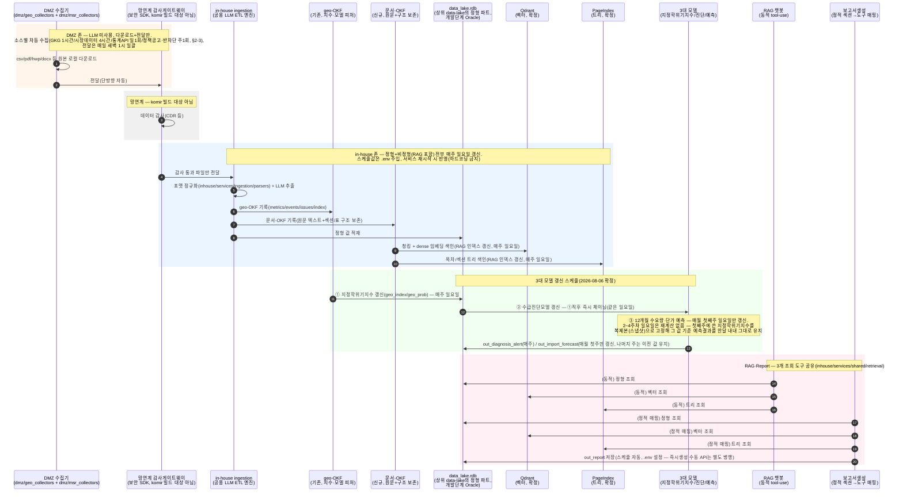
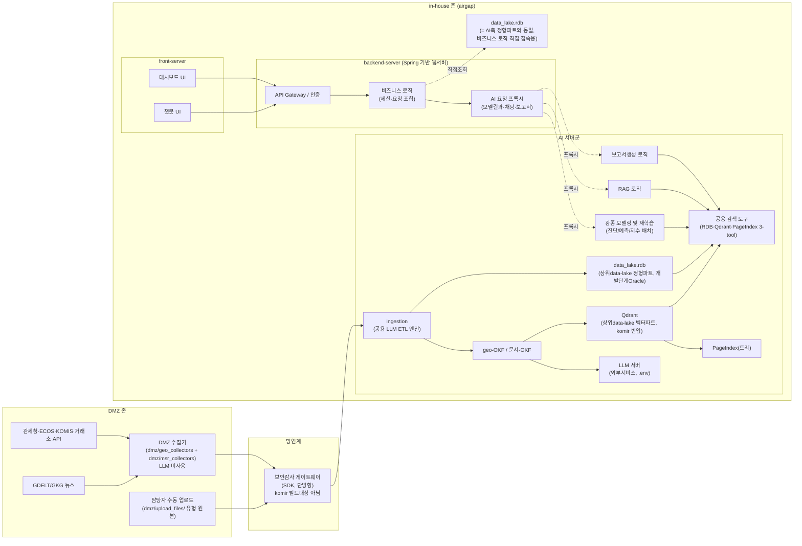

# 목표 아키텍처 — DMZ/망연계/in-house 데이터 흐름 (설계, 2026-08-06)

작성일: 2026-08-06
성격: **목표 설계**(미구현) — `documents/meta/CONTAINER_ARCHITECTURE.md` §0-1·§5·§6·§7의 시퀀스
다이어그램판. 8/6 대화에서 사용자가 직접 확정·정정한 배포 토폴로지를 반영.

> **현재 운영 상태와의 관계**: `전체프로세스_시퀀스다이어그램_260806.md`(같은 폴더)는
> **지금 실제로 도는 파이프라인**(단일 존, cron 기반)을 그린 것이고, 이 문서는 그것이
> 앞으로 향해야 할 **목표 구조**다 — 둘을 같은 걸로 혼동하지 말 것. 특히 지금
> `cron_gkg_increment.sh`는 다운로드(비-LLM)와 `gkg_verify`(LLM)를 같은 스크립트·같은
> 호스트에서 순차 실행 중인데, 목표 구조에서는 이 둘이 DMZ/in-house로 물리적으로
> 갈라진다.

## 1. 확정된 전제 (2026-08-06, 사용자 확인)

- **DMZ 존**: `dmz/geo_collectors`(GDELT/GKG, 구 `engine/geo/collectors`) + `dmz/msr_collectors`
  (관세청·ECOS·KOMIS·거래소 등, 구 `engine/mineral_supply_risk/msr/collectors`) 전부 —
  2026-08-06 물리적으로도 이 경로에 반영 완료. LLM 사용 불가. 원본(csv/pdf/hwp/docx 등) 로컬
  다운로드 → in-house 전달로 역할 종료 — 가공·DB 적재 없음.
- **망연계**: 단방향 자동 네트워크, 보안감사 SDK/솔루션이 중간에서 데이터 감사(CDR류)
  후 전달. komir이 빌드하는 대상 아님 — 인터페이스 지점으로만 취급.
- **in-house(airgap) 존**: LLM 서버 + 상위 data-lake 접속 가능. `ingestion`이
  공용 LLM ETL 엔진 — 원문 1건당 geo-OKF(기존, 지수·모델 피처용)와 문서-OKF(신규,
  원문+구조 보존) 두 산출물을 동시에 낸다.
- **상위 data-lake는 RDB와 동일 시스템이 아니라, RDB를 포함하는 더 큰 논리적 상위 개념**
  (2026-08-06 재정정 — 이전에 "RDB=data-lake 동일 시스템"으로 적었던 건 오독). **정형·
  비정형·벡터 3파트**로 구성(사용자 확정):
  - **정형 = `data_lake.rdb`**: 벤더 후보 Oracle·PostgreSQL 등(미확정), 개발단계는 Oracle.
    가공된 정형 데이터·RAG 정형 피처·진단/예측 모델 피처 전부 여기 적재. 지금 실제 운영
    중인 `inhouse/data_lake/db/minerals.duckdb`(구 `warehouse/minerals.duckdb`)는 **임시**
    이고 이쪽으로 이관 대상(현재상태 문서에도 주석 추가).
  - **비정형 = OKF·PageIndex 등**: 원문 보존(OKF)과 그 위의 구조 인덱스(PageIndex)가
    같은 파트로 묶임.
  - **벡터 = Qdrant(픽스)**: data-lake의 벡터 파트로 논리 소속되지만, **물리적으로는
    상위 data-lake가 이미 갖춘 인프라가 아니라 komir 쪽에서 in-house 시스템에 같이
    붙여서(직접 podman 소유·기동) 반입**하는 컴포넌트 — 논리적 소속과 물리적 소유는
    별개 축(둘 다 맞고 충돌 안 함).
- **RAG·Report 공용 도구**: `data_lake.rdb`(정형) 조회·Qdrant(벡터) 조회·PageIndex(비정형
  구조) 조회 3종을 `inhouse/services/shared/retrieval/`로 공유. 호출 방식은 RAG=동적, Report=정적
  (섹션→도구 매핑).
- **미해결(추측하지 않음)**: `data_lake.rdb` 최종 벤더, 비정형 파트(OKF)의 최종 저장 형식,
  PageIndex의 백킹 스토어 등 구현 세부(채택 여부 자체는 확정).
- **갱신 스케줄(2026-08-06 확정)**: ingestion(정형+비정형+RAG 인덱스 전부)은 **매주 일요일**
  트리거. 지정학위기지수는 그 안에서 매주 일요일 갱신, 수급진단모델은 지정학위기지수
  갱신 **직후 체이닝**(같은 일요일), 12개월 수요량·단가 예측은 **매월 첫째주 일요일만**
  갱신하고 나머지 주는 첫째주에 고정한 지정학위기지수 **복제본(스냅샷)**을 기준으로 이전
  예측 결과를 그대로 유지. 스케줄 값은 **.env로 주입**하고 **서비스 재시작으로 반영**
  (하드코딩 금지) — §2-2에 상세.
  **주의**: 현재 실제 운영 cron은 **토요일** 기준(`cron_gkg_increment.sh` 06:30 등, 다른
  문서 참고)인데 이 목표 스케줄은 **일요일** 기준 — 전환 시점에 명시적으로 처리 필요.

## 2. 전체 흐름 (시퀀스 다이어그램)

> **⚠ 다이어그램 주의(2026-08-06 재갱신)**: 위 그림의 "RDB" 노드는 상위 data-lake **자체가
> 아니라 그 정형 파트(`data_lake.rdb`)**다 — data-lake는 정형·비정형·벡터 3파트로 구성된
> 더 큰 논리적 상위 개념이고(§1), 이 시퀀스 다이어그램은 정형 파트만 등장시켜 단순화한
> 것이다. 벤더(Oracle 확정은 개발단계뿐, 최종 미정)가 남은 미확정 사항.

## 2-2. 갱신 스케줄 정책 (2026-08-06 확정)

| 대상 | 주기 | 트리거 방식 |
|---|---|---|
| ingestion(정형+비정형 전체) | 매주 일요일 | AI 서버군 스케줄러, .env로 시각 설정 |
| 지정학위기지수 | 매주 일요일 | ingestion 안에서 자동 연계 |
| 수급진단모델 | 매주 일요일 | 지정학위기지수 갱신 **직후 체이닝**(이벤트 기반, 별도 cron 아님) |
| 12개월 수요량·단가 예측 | **매월 첫째주 일요일만** | 그 외 주(2~4주차)는 재계산 없음 — 이전 예측 결과 그대로 서빙 |
| RAG 인덱스(Qdrant+PageIndex) | 매주 일요일 | ingestion의 문서-OKF 산출과 동시 색인 |

**"매월 첫째주"의 스냅샷 처리**: 예측모델은 지정학위기지수를 피처로 쓰는데, 지정학위기지수
자체는 매주 갱신되는 값이라 예측모델(월간 갱신) 입장에서 "어느 시점 값을 쓸지"가 불명확해질
수 있다 — 첫째주 일요일에 실행될 때 그 시점의 지정학위기지수를 **복제본(스냅샷)**으로
고정해 함께 저장하고, 이후 2~4주차에는 예측을 다시 돌리지 않고 첫째주 결과를 그대로 서빙한다.
재현성·감사 추적(artifact-provenance 원칙과 동일 취지) 차원에서 "이 예측이 어느 지정학위기지수
스냅샷 기준인지"가 항상 남도록 하는 설계다.

**설정 방식**: cron 표현식이나 스케줄 파라미터를 코드에 하드코딩하지 않고 `.env`로 주입,
값을 바꾸면 **해당 도커 서비스를 재시작**하는 것만으로 반영되도록 한다(사용자 확인).
**구현 시 주의**: "매월 첫째주 일요일"은 표준 POSIX cron 문법으로 정확히 표현하기 어렵다
(day-of-month와 day-of-week 필드가 OR로 결합되는 구현이 많음) — `inhouse/services/report_gen`에
이미 쓰기로 한 APScheduler의 `CronTrigger(day='1-7', day_of_week='sun')`처럼 day-of-month
범위(1~7)와 day_of_week를 **AND**로 결합하는 방식이 필요, 순수 cron 문자열 하나로는 부족할
수 있음.

**현재 실제 운영과의 차이(혼동 주의)**: 지금 도는 cron(`전체프로세스_시퀀스다이어그램_260806.md`
참고)은 **토요일** 기준(GKG 06:30, feeds 09:10/09:20)이고 모델 재학습은 **비정기 수동**이다.
이 목표 스케줄(일요일 기준, 3대 모델 전부 자동·체이닝)은 그것과 다른 미래 상태다 — 전환
시점에 실제 cron을 이 목표대로 다시 짜야 한다.

## 2-3. DMZ 수집기 스케줄 — 소스별 차등 주기 (2026-08-06 확정)

사용자 제안(GKG 1시간, 그 외 API·스크랩 4시간, airgap 전달 매일 새벽 1시)에 대해 의견을
드렸고 — **GKG 1시간·매일 새벽 1시 전달은 그대로 채택**, **"그 외 전부 4시간"은 소스
성격별로 차등하기로 조정**했다(사용자 동의). 근거는 실측 기록
(`해외기관_데이터수집_현황요약_260805.md`, `cron_collect_feeds.sh`)에서 가져왔다 —
추측으로 새 분류를 만들지 않음.

| Tier | 소스 | 현재 구현 위치 | 권장 주기 | 근거 |
|---|---|---|---|---|
| 0 (뉴스/이벤트) | GDELT/GKG | `dmz/geo_collectors/gdelt.py`·`gkg_bulk_download.py` | **1시간마다**(사용자 확정) | GDELT 실제 갱신 주기가 15분 단위라 시간당 수집이 실제 리듬과 부합, 정식 API라 부하 리스크 낮음 |
| 1 (시장데이터, 공식 API) | 거래소 재고(SHFE CU/NI·GFEX LI) | `scripts.collect_exchange_inventory` | **4시간마다** | 시장데이터라 실제로 하루 여러 번 값이 바뀜 — 촘촘한 수집이 실익 있음 |
| 1 | COT(CFTC) | `scripts.collect_forecast_exog` | **4시간마다**(도착 확인용) | 데이터 자체는 금요일 1회 발표지만, "발표됐는지" 체크는 자주 해도 API 자체엔 부담 없음(무료·공식) |
| 2 (정형 무역·경제 통계, 공식 API, 저빈도 원천) | 관세청·ECOS·Comtrade·Census(미)·BPS(인니)·ABS(호주)·ARCA(아르헨)·PSA(필리핀 대체)·BCRP(페루 대체)·COCHILCO(칠레) | `dmz/msr_collectors/customs_api.py`·`ecos_api.py`·`scripts.collect_tier1~4_feeds`·`scripts.collect_intl_agency_feeds trade` | **일 1회**(4시간마다 X) | 원 데이터가 월/분기 단위로만 갱신 — 4시간마다 불러도 대부분 응답이 동일해 신선도 이득이 없고, 관세청(1콜=1년 제한)·Comtrade(일 500콜 제한)처럼 실제 쿼터가 있는 곳은 과다호출 리스크만 커짐 |
| 3 (정책공고류, 최신분만 노출) | 중국 MOFCOM 수출통제 공고 | `scripts.collect_intl_agency_feeds policy` | **주 1회 유지**(변경 안 함) | 목록이 최신 ~15건만 반환돼 과거분 백필이 안 됨 — 문서에 이미 "주간 폴링으로 놓침 없이 축적"이 최적 전략으로 검증돼 있음(`해외기관_데이터수집_현황요약_260805.md` §1). 더 자주 불러도 이득 없고, 놓칠 위험도 원래 없음 |
| 4 (반차단·불안정 사이트) | GACC 상세(CU·REE만 부분 가능), 그 외 봇차단·WAF 이력 있는 소스 | 해당 시 별도 스크립트 | **주 1회 이하, 신중** | GACC는 JS챌린지 우회 5종 시도 이력이 있어 과다호출 시 완전 차단 위험 — 지금도 재시도 금지 목록(NI·CO·LI 상세)이라 스케줄 논의 자체가 낮은 우선순위 |

**airgap 전달**: 전 Tier 공통으로 **매일 새벽 1시** 1회, DMZ에 그날까지 쌓인 걸 일괄
전달(사용자 확정) — 수집 주기(1시간~주 1회)와 전달 주기(일 1회)를 분리하는 버퍼
역할. in-house ingestion은 그중 주간(일요일) 배치만 실제로 소비하므로, 매일 전달된
데이터는 다음 일요일까지 in-house 쪽 스테이징에 쌓여 있다가 한 번에 처리된다.

**설정 방식**: 다른 스케줄과 동일하게 `.env`로 주입(`GKG_COLLECT_CRON`,
`TIER1_COLLECT_CRON` 등), 서비스 재시작으로 반영 — 하드코딩 금지.

## 2-1. 시스템 구성도 (아키텍처, 2026-08-06 재작성)

§2가 "시간 순서"를 보여주는 시퀀스 다이어그램이라면, 이건 "어디에 뭐가 떠 있는가"를
보여주는 정적 구성도다.

> **⚠ 최초 버전 정정(2026-08-06)**: 처음엔 in-house 안에서 "backend-server"라는 이름으로
> ingestion·3대 모델·RAG·보고서생성을 전부 한 덩어리에 그렸는데, 사용자가 정정 —
> **AI(ingestion·모델링/재학습·RAG·보고서생성)와 backend-server는 별개**다. backend-server는
> **Spring 기반의 일반 웹서버**(API Gateway·인증·비즈니스 로직)이고, AI 관련 처리는 전부
> 독립된 **AI 서버군**에서 돈다 — backend-server는 AI 서버군에 요청을 프록시할 뿐이다.
> 아래는 이 구조로 다시 그린 것.

> **⚠ 두 번째 정정(2026-08-06)**: PageIndex를 "검토중"으로 표기했었는데, RAG·Report에
> 필요한 3개 도구(RDB·VectorDB·PageIndex) 중 하나로 사용자가 명시적으로 확정했음 —
> "검토중" 표기 전부 제거, 채택 확정으로 정정(구현 세부만 미정).

> **⚠ 세 번째 정정(2026-08-06)**: backend-server의 `비즈니스 로직`이 **상위 data-lake에
> 직접 연결**된다는 걸 빠뜨렸음 — 사용자 확인. AI 서버군을 거치는 프록시 경로와는 별개로,
> 비즈니스 로직이 전사 공용 데이터(AI 파이프라인과 무관한 사용자/조직 정보 등으로 추정)를
> 조회하러 상위 data-lake에 직접 붙는다. 아래 그림에 추가 반영.

> **⚠ 네 번째 정정(2026-08-06)**: "정형 RDB"와 "상위 data-lake"가 같은 시스템인지 계속
> 미해결로 남겨뒀는데, 처음엔 "동일 시스템"으로 정리했다가 — 이건 오독이었다. 사용자가
> 다시 정정: **상위 data-lake는 RDB보다 큰 논리적 상위 개념**이고, 그 안에 정형(`data_lake.rdb`)·
> 비정형(OKF·PageIndex)·**벡터(Qdrant)** 3파트로 구성된다(벡터 파트는 사용자가 뒤늦게
> 추가 확인 — "너무 억지인가" 자문했지만 벡터가 정형·비정형 어디에도 안 맞는 별개
> 데이터 형태라는 점에서 타당하다고 판단). Qdrant는 논리적으로 data-lake 벡터 파트에
> 속하지만 물리적으로는 상위 data-lake의 기존 인프라가 아니라 **komir이 in-house에
> 같이 반입(직접 소유·기동)**한다 — 논리 소속과 물리 소유는 별개 축. 지금 실제 운영 중인
> `inhouse/data_lake/db/minerals.duckdb`(구 `warehouse/minerals.duckdb`)는 임시이며
> `data_lake.rdb`로 이관 대상 — 관련 표기 전부
> 갱신, 현재상태 문서(`전체프로세스_시퀀스다이어그램_260806.md`)에도 주석 추가.

- **DMZ 존** → **망연계**(감사게이트웨이) → **in-house 존(airgap)**: 데이터 유입 경로(§1과 동일)
- **in-house 존(airgap) 안에 AI 서버군·front-server·backend-server 전부 포함**(사용자
  확인, 2026-08-06) — 셋 다 airgap 경계 안. 그중 **front-server**(UI) → **backend-server**
  (Spring, 일반 API/인증/비즈니스 로직) → **AI 서버군**(ingestion·광종 모델링/재학습·RAG·
  보고서생성·공용 검색도구·RDB/Qdrant/PageIndex/geo-OKF·문서-OKF/LLM서버) 순으로 연결되고,
  backend-server는 AI 서버군에 **프록시**로만 연결 — 직접 모델을 돌리거나 LLM을 호출하지
  않는다.

**근거**: `.drawio` 2페이지(§2 시퀀스 + 본 구성도)를 draw.io CLI로 실제 렌더링(PNG)해서
화살표가 다른 박스를 가로지르지 않는지 직접 눈으로 확인 후 커밋 — 여러 차례 좌표·연결점을
다시 잡았다(engine/scratchpad 작업, 최종본만 반영). AI 서버군/front-server/backend-server가
전부 in-house(airgap) 하나로 묶이도록 외곽 컨테이너를 추가한 것도 이번 정정.

## 3. 모듈별 역할 (목표 상태)

| 모듈 | 존 | 역할 | 비고 |
|---|---|---|---|
| `dmz/geo_collectors`, `dmz/msr_collectors`(구 `engine/geo/collectors`, `engine/mineral_supply_risk/msr/collectors`) | DMZ | 원본 다운로드, LLM 미사용, DB 미적재 | collectors 자체는 이미 fetch/load 분리(`sink` 콜백 패턴) — 실제 즉시-DB적재 지점은 `inhouse/mineral_supply_risk/scripts/backfill_customs_monthly.py` 등 드라이버 스크립트의 `_sink` 콜백. 리팩터 대상은 collectors가 아니라 이 드라이버들(`CONTAINER_ARCHITECTURE.md` §8, 2026-08-06 정정) |
| 보안감사 SDK/솔루션 | 망연계 | 데이터 감사 후 단방향 전달 | komir 빌드 대상 아님, 인터페이스만 |
| `inhouse/services/ingestion/parsers/*` | in-house | 포맷별(pdf/hwp/docx/xlsx 등) 텍스트+표 정규화 | 설계만, 스텁 |
| in-house LLM ETL 엔진(신규 통합) | in-house | 원문 1건당 geo-OKF+문서-OKF 동시 생성 | `inhouse/geo`의 기존 추출 로직 재사용·확장 |
| geo-OKF (`inhouse/data_lake/semi_structure/okf/`, 구 `geo_data/okf/`) | in-house | 지수·진단/예측 모델 피처용 파생 지식층 | 기존 그대로, 원문 포인터만 보유 |
| 문서-OKF(신규) | in-house | 원문 텍스트+구조 보존, Qdrant·PageIndex 공통 소스 | 신규 설계, 저장 위치 미정 |
| `data_lake.rdb`(상위 data-lake의 정형 파트, 2026-08-06 명명 확정) | in-house | 가공된 정형 데이터, RAG/모델 피처 | data-lake 자체는 아니고 그 정형 하위 파트. 벤더 미확정, 개발단계 Oracle. 지금 실제 운영 중인 `inhouse/data_lake/db/minerals.duckdb`(구 `warehouse/minerals.duckdb`)는 임시, 이관 대상 |
| Qdrant | in-house | 벡터 검색 | 확정(8/5) |
| PageIndex | in-house | 트리 기반 구조 탐색 | 채택 확정(백킹 스토어 등 구현 세부만 미정) |
| `inhouse/services/shared/retrieval/` | in-house | RDB·VectorDB·PageIndex 3종 공용 조회 도구 | RAG=동적 호출, Report=정적 매핑 |
| `inhouse/services/rag_chat` | in-house | 3개 도구를 에이전트형으로 동적 호출 | 설계만 |
| `inhouse/services/report_gen` | in-house | 3개 도구를 템플릿 섹션에 정적 매핑해 호출 | 설계만 |
| front-server(신규, 2026-08-06) | in-house | 사용자 대면 — 대시보드 UI, 챗봇 UI | backend-server에만 연결, AI 서버군과 직접 통신 없음 |
| backend-server(신규, 2026-08-06, 두 차례 정정) | in-house | **일반 웹서버(Spring)** — API Gateway/인증/세션/비즈니스 로직. AI 서버군에는 **프록시로만** 연결, **상위 data-lake에는 비즈니스 로직이 직접 조회**(전사 공용 데이터 추정) | 최초 버전은 이 서버 안에 ingestion·3대모델·RAG를 같이 그렸는데 사용자가 정정. 이후 상위 data-lake 직접 연계 누락도 사용자가 지적해 추가 |
| AI 서버군(신규, 2026-08-06 정정) | in-house | ingestion·광종 모델링/재학습·RAG 로직·보고서생성 로직·공용 검색도구 전부 | backend-server와 물리적으로 별개. RDB/Qdrant/PageIndex/geo-OKF·문서-OKF/LLM서버 전부 이 서버군이 직접 접속 |
| 상위 data-lake(정형·비정형·벡터 3파트 상위 개념) | in-house | backend-server 비즈니스 로직이 정형 파트(`data_lake.rdb`)를 직접 조회(전사 공용 데이터 추정) | AI 서버군이 접속하는 `data_lake.rdb`와 **같은 정형 파트**(2026-08-06 재정정 — "data-lake=RDB" 아니라 "data-lake ⊃ RDB"). 그림에는 두 접근 경로(AI/backend)를 보여주기 위해 별도 노드로 남겨둠 — 실체는 하나 |

## 4. 근거

이 문서의 모든 결정은 2026-08-06 대화에서 사용자가 직접 확인한 내용이며, 상세 논거는
`documents/meta/CONTAINER_ARCHITECTURE.md` §0-1·§5·§6·§7 참고. OKF 실물 구조(원문 포인터만
보유, 본문 없음)는 `inhouse/data_lake/semi_structure/okf/sources/*.md`·`inhouse/geo/okf.py` 직접 확인.
