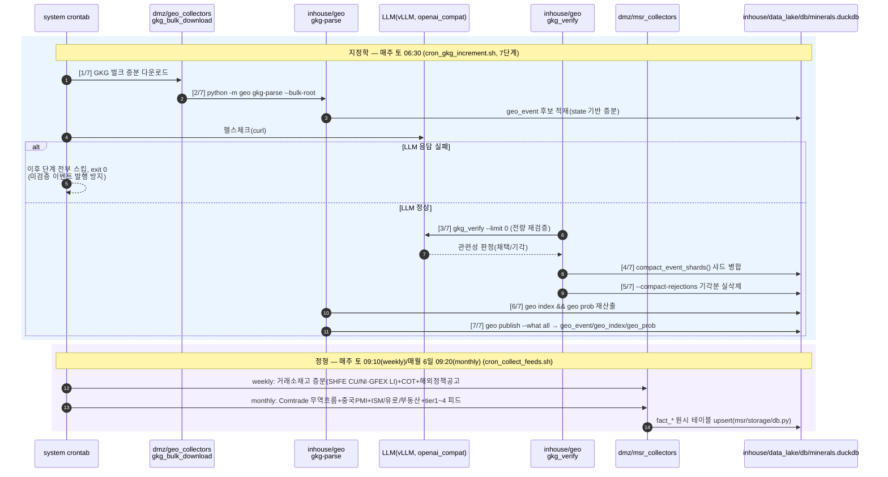
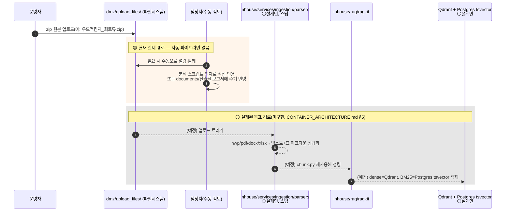
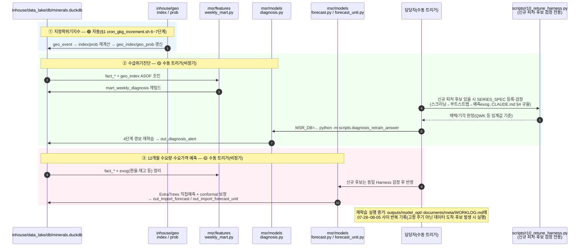
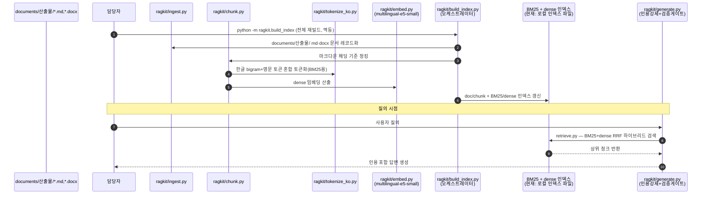

# 핵심광물 수급위기 진단·수요예측 시스템 — 전체 프로세스 시퀀스 다이어그램

작성일: 2026-08-06
목적: 원시자료 유입(수집·업로드) → 전처리/ETL → 중간·최종 산출물 생성 → 3대 모델(지정학위기지수·
수급위기진단·12개월 수요/가격예측) 주기 갱신 → RAG 데이터 갱신까지 전체 흐름을 시퀀스 다이어그램과
모듈별 역할표로 정리. **코드·crontab 실측 확인 기반**(추정 없음) — 자동/수동/설계전용 여부를 각
다이어그램·표에 명시.

> **⚠ 이 문서는 "지금 실제로 도는" 현재 운영 파이프라인이다(단일 존, cron 기반) — 목표
> 배포 구조(DMZ/망연계/in-house 3단 분리)와는 다르다.** 8/6 대화에서 사용자가 이 문서를
> 보고 실제 배포 요구사항(DMZ는 LLM 금지, 별도 존)과 다르다는 걸 짚어 목표 설계를 새로
> 정리했다 — `목표아키텍처_DMZ_inhouse_흐름_260806.md`(같은 폴더) 참고. 특히 §1의
> `cron_gkg_increment.sh`는 지금 다운로드(비-LLM)와 LLM 검증을 같은 호스트에서 순차
> 실행하는데, 목표 구조에서는 이게 DMZ/in-house로 갈라진다.
>
> **⚠ DB 표기 주의(2026-08-06 추가, 같은 날 후속 갱신)**: 아래 전 구간에서 "DB"로
> 표기한 건 **지금 실제로 쓰는 운영 DB가 맞다**(이 문서는 현재상태 기준이라 그대로 둠).
> 경로 표기는 `inhouse/data_lake/db/minerals.duckdb`(같은 날 뒤이어 실행된 DMZ/inhouse
> 물리 분리로 구 `warehouse/minerals.duckdb`에서 이 경로로 이동) — 파일 자체·내용은
> 불변, 저장 위치만 이동했다. 이것과 별개로 이 DuckDB 자체가 **임시**다 — 목표
> 구조에서는 정형 데이터가 `data_lake.rdb`(상위 data-lake의 정형 파트, data-lake
> 자체와 동일 시스템은 아님 — data-lake는 정형·비정형·벡터 3파트로 구성된 더 큰
> 논리적 상위 개념, 개발단계 Oracle)로 들어가도록 이관 예정. 자세한 건
> `목표아키텍처_DMZ_inhouse_흐름_260806.md` §1 참고.

## 범례(구현 상태)
| 표시 | 의미 |
|---|---|
| 🟢 자동 운영중 | 시스템 crontab에 등록되어 무인 실행 중 |
| 🟡 수동 운영중 | 코드는 존재·실사용되나 담당자가 필요 시점에 직접 실행 (고정 주기 아님) |
| ⚪ 설계만(미구현) | `documents/meta/CONTAINER_ARCHITECTURE.md` 등에 설계는 있으나 실제 코드는 스텁(`NotImplementedError`)이거나 부재 |

---

## 1. 원시데이터 수집 → ETL → 중간 산출물 (🟢 자동, cron)

정형(관세청·ECOS·KOMIS·거래소)과 비정형(GDELT/GKG 뉴스) 두 계열이 각자 독립된 cron으로 매주/매월
자동 수집·정제되어 같은 운영 DB(`inhouse/data_lake/db/minerals.duckdb`, 구 `warehouse/minerals.duckdb`)에 쌓인다.

**중간 산출물**: `geo_event`(검증완료 이벤트 원장), `fact_*`(관세청/ECOS/KOMIS/거래소 원시 팩트) —
아직 모델 입력 형태로 가공되기 전 단계.

---

## 2. upload_files/ 비정형 자료 반영 경로

`dmz/upload_files/`(우드맥킨지·기업주가 등 zip 원본, 구 `upload_files/`)를 실제로 파싱·적재하는
코드는 **현재 프로젝트 어디에도 없음**(전수 grep 재확인 완료). `inhouse/services/ingestion/
parsers/*.py`(hwp/pdf/docx/xlsx/xls/csv)는 전부 `raise NotImplementedError(...)` 스텁이며,
`documents/meta/CONTAINER_ARCHITECTURE.md` §5에 설계만 되어 있음.

**결론**: `dmz/upload_files/`는 현재 "자료함" 역할이며 ETL로 이어지는 자동 경로가 없다 — 이번 조사에서
드러난 실제 공백이므로, 다음 세션 우선순위 후보로 별도 기록해 둘 필요가 있음(§8 참고).

---

## 3. 3대 모델 주기적 갱신

세 모델 모두 §1의 중간 산출물(`geo_event`/`fact_*`)을 입력으로 쓰지만, **자동/수동 여부가 서로 다르다**
— 지정학위기지수는 §1 cron에 이미 포함되어 완전 자동인 반면, 수급위기진단·수요예측은 담당자가 신규
데이터 도착을 확인한 뒤 수동으로 재학습을 트리거한다(고정 주간 주기 아님, 비정기·실측 트리거 기반).

---

## 4. RAG 데이터 갱신 (🟡 수동 실행)

RAG는 `documents/산출물/` 하위 md·docx 보고서만 소스로 삼는다(DB 직접 소비 코드는 미확인). 신규
산출물 문서가 추가된 뒤 담당자가 인덱스 재빌드를 수동 실행한다.

---

## 5. 모듈별 담당 역할

| 모듈 | 역할 | 트리거 | 산출/소비 테이블·파일 |
|---|---|---|---|
| `dmz/geo_collectors/*`(구 `engine/geo/collectors/*`) | GDELT/GKG 뉴스·공시 원시 수집 | 🟢 cron(주 1회) | inbox → `geo_event` 후보 |
| `inhouse/geo/gkg_verify.py` | LLM 기반 이벤트 관련성 재검증 | 🟢 cron | `geo_event`(기각분 제거) |
| `inhouse/geo/index.py`·`prob_model.py` | 광종별 위기지수·NB2 강도확률 산출 | 🟢 cron | `geo_index`, `geo_prob` |
| `inhouse/geo/publish.py` | DB 발행 게이트 | 🟢 cron | `geo_event`/`geo_index`/`geo_prob` → duckdb |
| `dmz/msr_collectors/*`(구 `msr/collectors/*`) | 관세청·ECOS·KOMIS·거래소·해외기관 API 수집 | 🟢 cron(weekly/monthly) | `fact_*` |
| `msr/features/weekly_mart.py`·`marts.py` | raw→fact 정규화, ASOF 조인 마트 빌드 | 🟡 수동(모델 재학습 시 동반 실행) | `mart_weekly_diagnosis` 등 |
| `msr/models/diagnosis.py` | 4단계 경보 진단모델 학습·추론 | 🟡 수동(비정기) | `out_diagnosis_alert` |
| `msr/models/forecast.py`·`forecast_unit.py` | 12개월 수입물량·단가 예측(ExtraTrees+conformal) | 🟡 수동(비정기) | `out_import_forecast`, `out_import_forecast_unit` |
| `msr/models/alert.py` | 경보 사유·근거 문구 생성 | 🟡 수동(진단모델과 함께 실행) | `out_diagnosis_alert` 부가필드 |
| `msr/storage/db.py` | DuckDB 연결·upsert 공통 어댑터 | — (라이브러리) | 전 테이블 공통 |
| `scripts/r10_retune_harness.py` | 신규 피처·후보 스크리닝→부트스트랩 검정 게이트 | 🟡 수동(후보 발생 시) | 채택/기각 판정 리포트만(DB 미기록) |
| `inhouse/rag/ragkit/ingest.py`~`build_index.py` | `documents/산출물/` 문서 인덱싱 파이프라인 | 🟡 수동 | 로컬 BM25/dense 인덱스 |
| `inhouse/rag/ragkit/retrieve.py`·`generate.py` | 하이브리드 검색 + 인용답변 생성 | 🟡 수동(질의 시점) | — |
| `inhouse/services/ingestion/parsers/*` | 비정형 파일(hwp/pdf/docx/xlsx 등) 파싱 | ⚪ 설계만(스텁) | 없음 |
| `inhouse/services/report_gen/*` | 템플릿 기반 보고서 자동 생성·주기 저장 | ⚪ 설계만(스텁) | `out_report`(현재 0행) |
| `dmz/upload_files/`(구 `upload_files/`) | 제3자 원본자료 자료함 | 🟡 수동(사람이 직접 열람·발췌) | 없음(ETL 미연결) |
| `inhouse/data_lake/db/minerals.duckdb`(구 `warehouse/minerals.duckdb`) | 전 모듈 공용 canonical 운영 DB | — | 최종 소비: 대시보드·보고서. **임시**(2026-08-06) — 목표 구조에서는 `data_lake.rdb`로 이관 예정, 목표아키텍처 문서 §1 참고 |

---

## 6. 자동/수동 경계 요약

- **완전 자동(🟢)**: 지정학위기지수 전 구간(수집→검증→지수화→발행). 정형 데이터 수집(관세청·ECOS 등)도
  cron으로 자동 — 단, 그 데이터를 이용한 **모델 재학습 자체는 수동**.
- **수동이지만 코드 기반 반복 실행(🟡)**: 진단·예측 모델 재학습, RAG 인덱스 재빌드, 신규 피처 검정
  (`r10_retune_harness.py`) — 전부 실제로 반복 사용되는 코드지만 사람이 트리거해야 함.
- **설계만 있고 코드 없음(⚪)**: `dmz/upload_files/` → ETL 자동화, `inhouse/services/ingestion`·
  `inhouse/services/report_gen` 전체. `documents/meta/CONTAINER_ARCHITECTURE.md`에 설계 문서는
  있으나 구현은 다음 세션 이후로 명시적으로 미룬 상태(2026-08-05 확정).

## 7. 근거

> 아래 경로는 이 문서 작성(2026-08-06) 당시 실측한 경로다. 같은 날 뒤이어 실행된 DMZ/inhouse
> 물리 분리로 `engine/`·`docs/`·루트 `upload_files/`는 없어지고 `dmz/`·`inhouse/`·
> `documents/meta/` 아래로 옮겨졌다 — 재현 시엔 새 경로를 쓸 것(내용은 git mv로 이력 보존,
> 동일 파일).

- `inhouse/geo/cron_gkg_increment.sh`(7단계 전문), `inhouse/geo/__main__.py`(서브커맨드), `inhouse/geo/publish.py`
- `inhouse/mineral_supply_risk/scripts/cron_collect_feeds.sh`, `crontab -l`(2026-08-06 실측)
- `inhouse/mineral_supply_risk/scripts/diagnosis_retrain_answer.py`(헤더 수동 실행 명령), `scripts/r10_retune_harness.py`
- `inhouse/mineral_supply_risk/outputs/model_opt/` 타임스탬프, `documents/meta/WORKLOG.md`(07-28~08-05 재학습 반복 기록)
- `inhouse/rag/ragkit/*.py`, `documents/meta/DB_SCHEMA.md`(테이블 생산/소비 매핑)
- `inhouse/services/ingestion/parsers/*.py`(NotImplementedError 스텁 확인), `documents/meta/CONTAINER_ARCHITECTURE.md` §5/§6
- `dmz/upload_files/` 전수 grep(코드 참조 0건, 2026-08-06 재확인)

## 8. 발견된 공백(후속 논의 필요)

- `dmz/upload_files/`에 쌓인 원본(우드맥킨지 등)을 실제로 모델 피처나 RAG 문서로 반영하는 자동
  경로가 없다 — 현재는 사람이 수동으로 열람·발췌하는 방식에 의존. `inhouse/services/ingestion`
  구현이 이 공백을 메우는 설계이나 아직 착수 전.
- `out_report` 테이블은 현재 0행 — report_gen 서비스 미구현과 일치.
