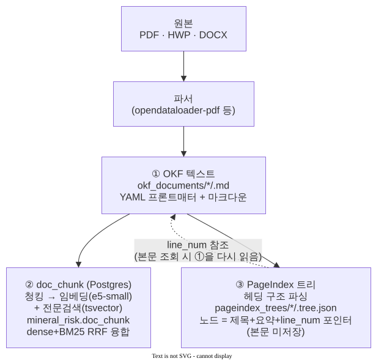

# OKF·PageIndex 색인 구조와 저장소 사용량 설명 (2026-08-26)

## 왜 이 문서를 쓰는가

RAG 검색 계층이 원본 문서 하나를 여러 형태(OKF 텍스트, pgvector 청크+임베딩,
PageIndex 목차 트리)로 중복 저장한다 — "왜 같은 데이터를 여러 벌로 색인해서
저장소를 잡아먹는가"에 대한 답을 실측 수치와 함께 정리한다. 결론부터 말하면:
**중복이 아니라 서로 다른 실패모드를 보완하는 별도 계층**이고, 전체 비용은
약 1GB 남짓으로 이 프로젝트 규모에서는 낮은 편이다.

## 1. 3층 구조 — 왜 한 문서가 세 벌로 존재하는가

(원본 draw.io 파일: `OKF_PageIndex_3층구조_260826.drawio` — SVG에 XML이
임베드돼 있어 draw.io로 다시 열어 편집 가능)

- **①(OKF)**: 모든 검색 방식의 공통 원천. 파서가 원본에서 딱 한 번만 뽑는다.
- **②(doc_chunk)**: ①을 고정 크기로 잘라 임베딩+전문검색 색인을 얹은 것 —
  "의미/어휘가 비슷한 문단 찾기"에 최적화된 표현.
- **③(PageIndex 트리)**: ①의 헤딩 구조만 파싱한 목차 — 본문을 따로 저장하지
  않고 항상 `line_num`으로 ①을 다시 읽어온다. "이 대형 보고서의 어느 섹션에
  있나"를 찾는 데 최적화된 표현.

②와 ③은 **같은 원본을 서로 다른 질문 유형에 맞게 재구성한 것**이지, 같은
정보를 그냥 베낀 게 아니다 — ②는 본문을 통째로 복제(청크별로)하지만 ③은
본문을 복제하지 않고 위치만 가리킨다(그래서 ③이 ②보다 훨씬 작다, 아래 §3).

## 2. 왜 하나로 합칠 수 없는가 — 실측으로 확인된 실패모드

| 실패모드 | 원인 | 실측 사례 |
|---|---|---|
| 청크가 표/섹션 경계를 잘라먹음 | ②는 고정 크기 청크 단위라 구조가 큰 통계표를 쪼갠다 | "구리 많이 나는 나라는?" 질의에 dense+BM25 8건이 전부 가격뉴스였고 정작 있는 생산국 표는 후보에 안 들었음 |
| 국가별 순위·비교(멀티홉) | ②는 문서 하나 안의 유사 문단만 찾을 뿐, 광종 수십 개 섹션을 대조해 집계하는 건 못 함 | USGS가 광종별로 조직돼 있어 "이 나라가 몇 번째로 많이 캐는 광종은?" 류는 여러 섹션을 순회해야 함(`pageindex_agent.py`) |
| LLM이 표를 잘못 읽음 | 재순위(reranker)를 아무리 잘 붙여도 생성 단계의 표 해석 오류는 못 막음 | 알파벳순 국가 나열을 순위로 착각해 "콩고민주공화국이 주석 세계 2위"라고 오답(실제 5위) — PageIndex가 `_rank_countries()`로 순위를 결정적으로 계산해 근거에 박아 넣어 차단 |
| 반대 방향 실패(③만 있었다면) | PageIndex 스코어링은 단순 토큰 겹침이라 애매한 서술형 질문엔 약함 | 그래서 ③이 ②를 대체하지 않고, 라우터가 질문 유형별로 선택(`chatbot_graph.py ROUTE_PROMPT`) |

즉 ②만 있으면 구조화된 대형 보고서 질문을 놓치고, ③만 있으면 일반 서술형
질문에서 정밀도가 떨어진다 — 두 계층을 다 가진 채 "언제 무엇을 쓸지"만
라우팅하는 게 지금 구조다.

## 3. 실측 저장소 사용량 (2026-08-26 직접 측정)

전체 1,642개 문서(OKF 기준, 그룹별 세부는 아래) 기준.

| 계층 | 크기 | 비고 |
|---|---|---|
| ① OKF 텍스트 (`okf_documents/`) | **139 MB** | 마크다운 원문 |
| ③ PageIndex 트리 (`pageindex_trees/`) | **60 MB** | 본문 미포함, 제목+요약+포인터만이라 ①보다 작음 |
| ② doc_chunk 테이블(Postgres, 140,085행) | **272 MB** | 청크 텍스트+메타 |
| ② HNSW 벡터 인덱스 | **269 MB** | 임베딩 384차원 × 14만행 |
| ② 전문검색(GIN, tsvector) 인덱스 | **91 MB** | BM25용 |
| ② 기타 인덱스(chunk_id·doc_id) | **~12 MB** | |
| **② 소계(테이블+인덱스 전체)** | **829 MB** | `pg_total_relation_size` |
| **합계** | **약 1.03 GB** | |

문서군별 OKF·트리 용량(참고):

| 문서군 | 문서수 | OKF | PageIndex 트리 |
|---|---|---|---|
| Argus_비철금속_일일 | 690 | 71 MB | 39 MB |
| 조달청보고서 | 868 | 62 MB | 19 MB |
| 생산매장량_USGS | 8 | 5.6 MB | 1.8 MB |
| 산출물(자체 산출물) | 72 | 1.2 MB | 1.1 MB |
| 외부자료 | 4 | 272 KB | 24 KB |

**벡터 인덱스(269MB)가 doc_chunk 전체(829MB)의 약 1/3을 차지**하는 게 특징적인데,
이건 PageIndex와 무관하게 dense 검색 자체의 고정비용(384차원 임베딩 14만개)이다
— PageIndex 트리는 오히려 원본(OKF)보다도 작다(60MB < 139MB), 본문을 복제하지
않기 때문이다.

## 4. 결론 — 비용 대비 무엇을 얻는가

- **총 비용**: 원본 문서 1벌을 세 가지 표현으로 유지하는 데 약 1GB. 현재 프로젝트
  데이터 규모(문서 1,642건, 청크 14만 건)에서는 낮은 비용이다 — 서버 디스크
  기준 무시할 만한 수준.
- **얻는 것**: dense+BM25 단독으로는 구조적으로 놓치는 질문 유형(대형 보고서의
  섹션/표 질의, 국가별 순위·비교형 멀티홉 질의)을 커버하고, 표 해석 오류 같은
  생성 단계 실패까지 근거 단계에서 차단한다 — 전부 실측 실패 사례에서 역산해
  만든 계층이지, 사전 설계로 미리 얹은 게 아니다.
- **중복처럼 보이지만 실제로는 저비용**: PageIndex 트리는 본문을 복제하지
  않아(위치 포인터만) 원본보다 작고, 두 계층이 겹치는 범위는 "같은 원본을
  가리킨다"는 것뿐 실제 바이트 중복은 크지 않다.

## 참고

- 색인 파이프라인: `services/ingestion/build_pgvector_okf.py`(②), `services/
  ingestion/build_pageindex_trees.py`(③)
- 조회 도구: `services/shared/retrieval/{hybrid_pg,pageindex,pageindex_agent}.py`
- 라우팅 로직: `rag/ragkit/chatbot_graph.py`(`ROUTE_PROMPT`)
- 관련 실측 기록: `documents/meta/WORKLOG.md` 2026-08-13 "pageindex_agent 신설"
  절, 2026-08-26 조달청보고서 헤딩결함 수정(이번 세션)
