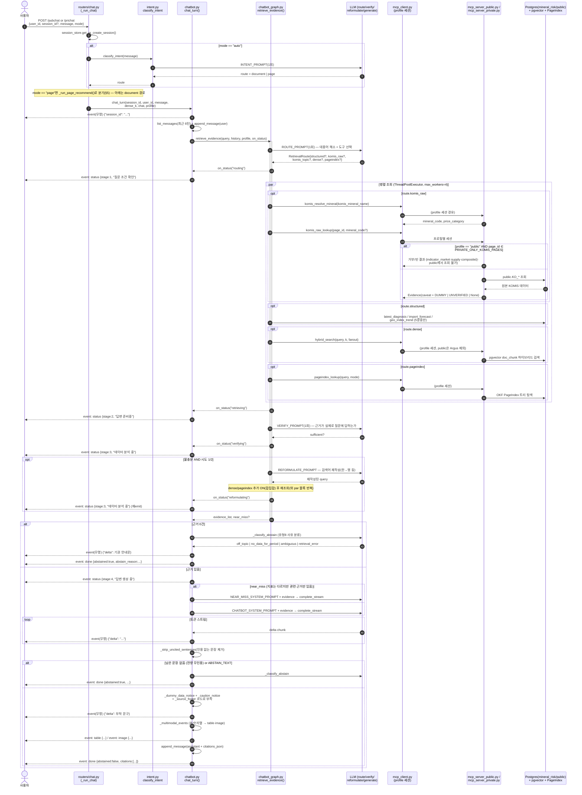

# 챗봇(RAG) 아키텍처 — 요청 처리 흐름 (2026-09-03 갱신판)

> 대상: `inhouse/rag/ragkit/`(코어 로직) + `inhouse/services/rag_chat/`(FastAPI 서빙) +
> `inhouse/services/shared/`(공용 DB·LLM·근거 계약).
> 데이터 접근 계층(Postgres `mineral_risk`/`public` 스키마 구분, MCP 도구 8종의
> 스키마 소유권)은 이미 `documents/meta/CHATBOT_POSTGRES_MCP_SPEC.md`에 상세
> 문서화돼 있다 — 이 문서는 그걸 대체하지 않고, **사용자 질문이 들어와서 SSE
> 응답으로 나가기까지의 end-to-end 흐름**에 초점을 맞춘다. 컨테이너 배포 구조는
> `documents/meta/CONTAINER_ARCHITECTURE.md` 참조.
>
> **이 문서는 [`챗봇_아키텍처_처리흐름_260901.md`](./챗봇_아키텍처_처리흐름_260901.md)의
> 갱신판이다.** 260901판 이후 라운드(skeptic-code 2차 감사 수정 16건 중 챗봇 관련
> 3건, MCP public/private 접근 경계 명문화, composite_index 특례 등)를 전부 반영해
> 코드를 다시 읽고 새로 썼다 — 이번엔 별도 `.drawio` 파일 대신 시퀀스 다이어그램을
> 이 문서 안에 Mermaid로 내장한다(§3). 260901판·`.drawio` 파일은 그 시점 스냅샷으로
> 보존, 재현 시엔 이 문서를 기준으로 할 것.
>
> 작성일: 2026-09-03.

## 1. 개요

`rag_chat` 서비스는 핵심광물 수급위기 진단·수요예측 프로젝트의 챗봇 API다. 사용자
질문 한 건을 받아 **문서 Q&A**(komir 자체 산출물 + KOMIS 공개원천 + 비정형 보고서를
근거로 인용강제 답변 생성) 또는 **페이지 추천**(KOMIS 화면·메뉴 안내) 중 하나로
라우팅하고, 결과를 SSE(Server-Sent Events)로 스트리밍한다. `POST /pubchat`·
`POST /prichat` 두 엔드포인트가 실제 API 표면이다(`/chat` 하위호환 별칭은 구현만
남고 라우트 미등록 — 404).

**두 엔드포인트의 차이는 "어떤 데이터"가 아니라 "누구"다** — public/private은
콘텐츠 종류 축이 아니라 **사용자 신원·등급 축**이다:

- **`/prichat`(private, `mcp_server_private.py`)** = **inner circle**(내부 관계자·
  신뢰된 사용자) — public 데이터 + private 전용 데이터를 **전부** 조회 가능한
  **상위집합**. 제한 로직 자체를 import하지 않는다(구조적으로 걸러낼 게 없음).
- **`/pubchat`(public, `mcp_server_public.py`)** = **익명(anonymous)** 불특정
  사용자 — 라이선스 제한 제3자 콘텐츠(Argus)와 KOMIS 로그인 필요 지표 3종을
  뺀 **부분집합**만 조회 가능.

말은 "private"지만 등급으로 보면 public보다 **높은** 등급의 인터페이스라는 뜻이다
(§4-2에서 상세).

## 2. 요청 처리 파이프라인

```text
POST /pubchat 또는 /prichat (routers/chat.py)
  └─ _run_chat(request, profile)                    profile: "public" | "private"
       ├─ session_store.get_or_create_session(...)
       ├─ mode 결정: request.mode가 "document"/"page"면 그대로,
       │    "auto"(기본값)면 app/intent.py::classify_intent(message) — LLM 1회 호출
       ├─ mode == "page"     → _run_page_recommend()   (§5, 이 문서에서는 간략히만)
       └─ mode == "document" → _run_document_qa(profile) → rag.ragkit.chatbot.chat_turn()
```

`chat_turn()`(`rag/ragkit/chatbot.py`)이 문서 Q&A 경로의 실제 코어다.
프레임워크 독립적(FastAPI/SSE 의존 없는 순수 async generator)이라
`routers/chat.py`는 이걸 SSE 프레이밍으로 감싸기만 한다(`_drain_sync`로 동기
제너레이터 브리지).

## 3. 시퀀스 다이어그램

### 3-0. 기획 검토용 러프 버전

기술 세부사항(도구 이름·프롬프트 상수·SSE 이벤트 payload) 없이 "질문→분류→
근거조사→답변" 흐름만 보여주는 단순화 버전이다. 기획 검토·발주처 설명용으로는
이쪽을 먼저 볼 것 — 상세 버전(§3-1)은 구현 재현·디버깅용이다.

파일: [`챗봇_시퀀스다이어그램_기획용_260903.drawio.svg`](./챗봇_시퀀스다이어그램_기획용_260903.drawio.svg)
(draw.io XML 내장 SVG — draw.io로 열면 그대로 편집 가능. 원본 `.drawio`도 같은
폴더에 보존: [`챗봇_시퀀스다이어그램_기획용_260903.drawio`](./챗봇_시퀀스다이어그램_기획용_260903.drawio))

### 3-1. 상세 버전 — 문서 Q&A 경로 (mode=document)



## 4. 라우팅·조회 단계 상세

### 4-1. document vs page (`intent.py`)

`mode="auto"`일 때만 호출되는 LLM 1회 분류기. 현재 기준(2026-08-31 최종
확정, `intent.py` 상단 주석에 라운드별 회귀수정 이력 상세 기록):

- **page**: 사용자가 원하는 게 "화면·기능의 위치" 자체이거나 화면 데이터를
  통째로 보고 싶어할 때만. ①어느 화면/메뉴로 가야 하는지 직접 묻는 질문,
  ②기능·설정의 위치를 묻는 질문, ③"전체 데이터"를 통째로 요청하는 질문 —
  이 세 가지뿐.
- **document**: 그 외 전부. 특정 수치·시계열 조회("니켈 가격 알려줘")도
  document다 — 근거 조회 단계가 komir 자체 산출물 + KOMIS 공개원천 원자료를
  직접 찾아 답하기 때문("화면 위치는 안 물어도 수치 자체를 원하면 page"라는
  옛 기준은 `komis_raw_lookup` 신설로 폐기됨).

분류 실패(LLM 오류) 시 안전하게 `document`로 폴백한다(문서 경로는 근거 0건이면
기권으로 끝나 오분류 비용이 더 작다는 설계 판단).

### 4-2. MCP public/private 프로필 경계 (`shared/retrieval/access.py`)

`access.py`가 단일 진리원이다:

| 상수 | 값 | 적용 도구 |
|---|---|---|
| `PRIVATE_ONLY_SOURCE_GROUPS` | `{"Argus_비철금속_일일"}` | `hybrid_search`, `pageindex_lookup` |
| `PRIVATE_ONLY_KOMIS_PAGES` | `{"indicator_market", "indicator_supply", "indicator_composite"}` | `komis_raw_lookup` |

`mcp_server_public.py`는 `register_common_tools(mcp, private_only_pages=PRIVATE_ONLY_KOMIS_PAGES)`로
이 제한을 명시적으로 넘기고, `mcp_server_private.py`는 인자 없이(빈 집합)
등록한다 — private 쪽엔 제외 로직 자체가 없다(2026-09-03 사용자 직접 명확화:
"private는 inner circle, public은 어노니머스"). **private에 필터를 추가하는
것은 역방향 설계 위반**이므로 향후 수정 시 주의.

### 4-3. `route → retrieve → verify → (reformulate → retrieve → verify) → finalize`

`chatbot_graph.py`가 LangGraph `StateGraph`로 이 상태그래프를 돈다
(`MAX_ATTEMPTS=2`, 최초 1회 + 재시도 1회).

- **route** (`ROUTE_PROMPT`, LLM 1회): 히스토리 기반 대용어 해소(`resolved_query`)
  + 4개 도구 중 무엇을 켤지 결정(`RetrievalRoute`):
  - `structured`: komir 자체 산출물(`latest_diagnosis`/`import_forecast`/
    `geo_index_trend`) — **5광종(CU/NI/CO/LI/REE)만** 계산돼 있어 데이터
    자체의 한계로 제한.
  - `komis_raw`: KOMIS 공개원천 8개 토픽(`price`·`price_forecast`·
    `domestic_trade`·`global_trade`·`reserves_production`[매장량+생산량
    통합 1개 토픽]·`market_outlook`·`supply_stability`·`composite_index`)
    — 5광종 제한 없음. **광물종합지수(`composite_index`)만
    예외적으로 광종명 없이도 호출 가능**하다(2026-09-02 추가 — 지수 자체가
    특정 광종에 매인 게 아니라 여러 지표를 합성한 값이라 mineral_code가 없어도
    질문이 성립하기 때문. `ROUTE_PROMPT`에 이 예외가 명시돼 있다).
  - `dense`(pgvector 하이브리드 검색), `pageindex`(OKF 트리 탐색, `simple`|
    `agentic` 모드) — 비정형 보고서 대상, 광종 제한 없음.
- **retrieve** (`_retrieve_node`): route가 켠 도구들을 `ThreadPoolExecutor(4)`로
  병렬 호출. `komis_raw`를 켰으면 먼저(동기) `komis_resolve_mineral`로 광종명을
  코드로 바꾼 뒤 페이지ID를 결정적으로 매핑한다 — **단, `komis_topic ==
  "composite_index"`이고 광종명이 없을 때는 이 해소 단계 자체를 건너뛴다**
  (2026-09-02 수정, SC-CB2-001/002 — 예전엔 억지로 `mineral_code`를 채워 넣어
  `Evidence.section`이 `"KO_MNRL_SNTHS_INDX(니켈)"`처럼 실제로는 광종별
  필터가 없는 지수를 특정 광종 것처럼 잘못 표기했었다). 도구 하나가 실패해도
  나머지로 부분 열화 진행.
- **verify** (`VERIFY_PROMPT`, LLM 1회): 근거가 실제로 질문에 답하는지 확인
  ("같은 광종·주제"만으론 불충분 — 지표 자체가 달라도 불충분). 근거 0건이면
  LLM 호출 없이 바로 불충분 처리.
- **reformulate**: 불충분 판정 시 검색어 재작성(한국어→영어 전문용어 보강
  등) + `dense`/`pageindex`를 추가로 켜고(끄지 않음, 합집합) 재조회.
- **finalize**: 재시도 후에도 불충분하면 — 근거가 하나도 없으면 기권 경로로,
  근거가 있으면(지표는 다르지만 관련은 있음) `retrieval_near_miss` 경고를
  달아 near-miss 제안형 답변(§5)의 재료로 남긴다.

`on_status` 콜백이 내는 문자열 stage(`routing`/`retrieving`/`verifying`/
`reformulating`)는 `chatbot.py::_GRAPH_STAGE_TO_STATUS`로 SSE 정수 계약
1~3에 매핑된다(`routing→1`, `retrieving→2`, `verifying`·`reformulating→3`,
재시도로 3이 두 번 나올 수 있음 — 정상). stage 4(생성 중)는 `chat_turn`이
그래프 콜백과 무관하게 직접 emit한다.

## 5. 답변 생성 — 인용 규칙과 이중 caveat

`CHATBOT_SYSTEM_PROMPT`(일반 문서 Q&A)와 `NEAR_MISS_SYSTEM_PROMPT`(근접매칭
제안형)로 갈린다. 인용강제 규칙(오직 [근거]만, 숫자·이름 날조 금지, 인용
없는 문장 금지)은 `generate.py`(비-챗봇 RAG 경로와 공유) 원칙을 상속하되,
어투·유형별 지시(`documents/order/chatbot_rule.txt`)를 얹은 별도 프롬프트
상수를 쓴다.

`_strip_uncited_sentences` 통과 **이후**에만 코드로 강제 부착(스트리퍼가
지우기 전에 붙이면 무인용 취급돼 함께 지워짐):

1. **`_dummy_data_notice`** — 인용된 근거의 `Evidence.caveat`가 채워져
   있으면 매 인용마다 경고를 강제 부착. **2026-09-02부터 caveat이 두 가지로
   분리됐다**(`shared/retrieval/evidence.py`):
   - `KOMIS_RAW_DUMMY_CAVEAT`("실제 값이 아닙니다") — `ko_data_src_cd`로
     **확정** 개발용 더미임을 판별한 경우만.
   - `KOMIS_RAW_UNVERIFIED_CAVEAT`("확인할 수 없는 데이터입니다 — 참고용")
     — 더미/실데이터 판별 자체가 구조적으로 불가능한 경우(예: 광물종합지수는
     소스구분 컬럼이 없어 판별 불가 — SC-CB2-001 초기 수정에서 이 케이스를
     `is_dummy=True`로 잘못 단정했던 것을 재검토 후 정정).
   `is_dummy`가 우선이며(둘 다 True인 조합은 설계상 발생하지 않음), `_dummy_data_notice`는
   이 둘을 구분해 각자의 문구를 붙인다.
2. **`_caution_notice`** — `structured`(특히 `latest_diagnosis`) 근거가
   인용되면 "인과관계 단정 아님" 주의 문구.
3. **`_source_footer`** — 인용된 근거의 출처 목록.

**near-miss 복수인용 함정**(2026-08-31 실사용 버그): 인용 스트리퍼
(`CLAUSE_RE`)는 `[1][2][3]`처럼 대괄호가 개별로 붙은 형태만 매칭한다 — LLM이
`[1, 2, 3]`처럼 하나의 대괄호에 몰아 쓰면 문장 전체가 무인용으로 간주돼
통째로 사라진다. `NEAR_MISS_SYSTEM_PROMPT`에 개별 대괄호 형식을 명시해
수정.

**유형8(범위 밖 질문) 사유 분류**(`_classify_abstain`): 근거 0건 기권과,
생성 LLM이 스스로 `ABSTAIN_TEXT`로 기권한 경우 둘 다에서 호출.
`off_topic`/`no_data_for_period`/`ambiguous`/`retrieval_error` 네 갈래로
분류(5광종 화이트리스트 폐기와 함께 `unsupported_commodity`/
`similar_commodity` 두 유형은 2026-09-01 제거됨).

## 6. page 경로 (요약, `_run_page_recommend`)

document 경로와 달리 status는 1·4만 낸다(중간 단계를 안 쪼갬). 그래프
호출(`page_recommend/service.py`) 자체가 단일 blocking 호출이라 응답도 LLM
토큰 스트림이 아닌 완성 텍스트를 `delta` 한 번으로 내보낸다. `profile`은 이
경로에 영향 없음(hybrid_search/pageindex_lookup을 쓰지 않음).

## 7. 260901판 이후 변경 요약

| 항목 | 260901 상태 | 260903 현재 |
|---|---|---|
| MCP public/private 접근 경계 | 산발적 언급 | `access.py` 단일 진리원으로 명문화, `PRIVATE_ONLY_*` 상수 표로 정리 |
| composite_index + 광종명 없음 | 미지원(광종 강제 요구) | `ROUTE_PROMPT` 예외로 광종명 없이 조회 허용 |
| `_retrieve_node`의 composite_index | mineral_code를 억지로 채워 `Evidence.section` 오표기 | 해소 단계 스킵, `mineral_code=None` 유지 |
| 더미데이터 caveat | 단일(`KOMIS_RAW_DUMMY_CAVEAT`, "실제 값 아님") | `KOMIS_RAW_UNVERIFIED_CAVEAT` 분리("판별 불가") — 확정 더미 vs 판별불가 구분 |
| public/private 의미 | "라이선스 콘텐츠 포함 여부" 정도로만 서술 | "사용자 신원·등급 축"으로 명확화(inner circle vs 익명) — 사용자 직접 정정 |
| 다이어그램 형식 | `.drawio`(별도 파일) | Mermaid 내장(이 문서 §3) |
